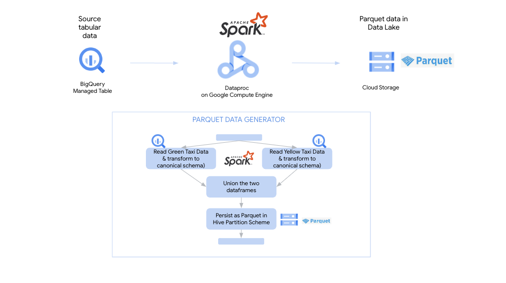
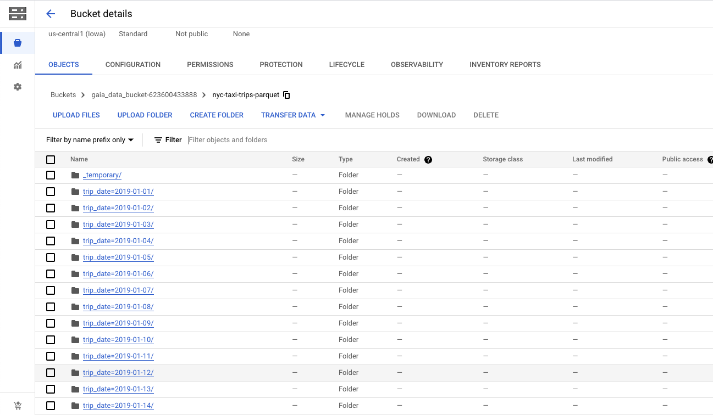
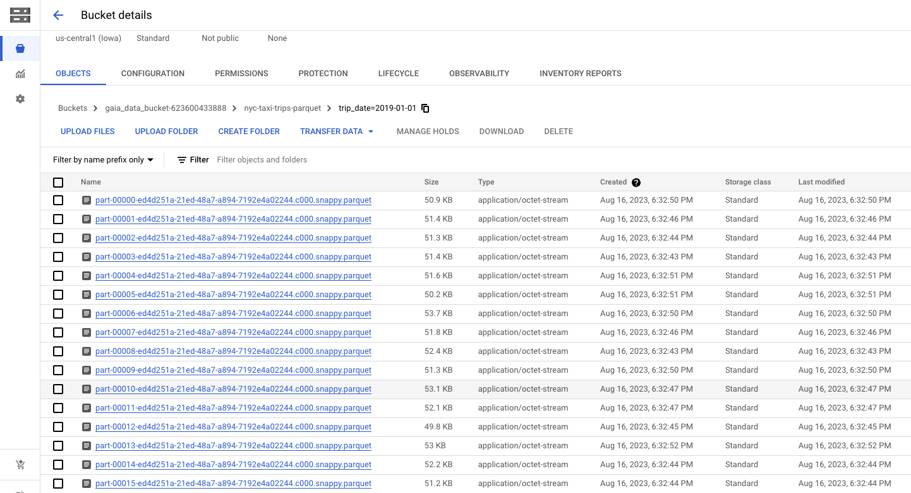

# Module 2: Generate Parquet data for the lab

In this module and next, we will generate data for the lab that we will persist in our data lake in Cloud Storage. We will generate two flavors of persistence formats - Parquet and Hudi to showcase performance variations WRT BigLake queries. 

## Lab Module Prerequisite
Successful completion of prior module

## Lab Module Goals

Fundamentaly, this module covers creating a Parquet dataset of NYC taxi trip data available in BigQuery as a public dataset. The following are implicit. 

| # | Goal | 
| :-- | :--- |  
| 1 |  Provide gentle introduction to querying in BigQuery, through a practial example, if unfamiliar | 
| 2 |  Provide gentle introduction to Dataproc on Google Compute Engine through practical example, if unfamiliar - specifically Dataproc Spark jobs API|
| 3 |  Provide gentle introduction to Apache Spark connector for BigQuery (native tables) through practical example, if unfamiliar  | 
| 4 |  Provide gentle introduction to Apache Spark connector for Cloud Storage through practical example, if unfamiliar  | 

<hr>
   
## Lab Module Duration

40 minutes 

<hr>

## Lab Module Flow

   
<br><br>

<hr>


## Lab Module Solution Architecture

   
<br><br>


<hr>

## References

| # | Asset/Artifact/Documentation | 
| :-- | :--- |  
| 1 |  [Git repo](https://github.com/GoogleCloudDataproc/spark-bigquery-connector) for more information about the Apache Spark BigQuery connector | 

<hr>

## 1. About the data

### 1.1. Source
We will read the New York yellow and green taxi trip data in BigQuery public dataset into a canonical data model and perist to our data lake in Cloud Storage in Parquet and Hudi formats. 

|  |  |
| -- |:--- |
| Source for Yellow Taxi Tables |  bigquery-public-data.new_york_taxi_trips.tlc_yellow_trips_YYYY where YYYY is the year |
| Source for  Green Taxi Tables |  bigquery-public-data.new_york_taxi_trips.tlc_green_trips_YYYY where YYYY is the year  |
| Years of data | 2019, 2020, 2021, 2022 |


### 1.2. Data Model 

The NYC yellow and green taxi trips have different schemas. We have created a canonical data model and mapped the individual schemas of yellow taxi trips and green taxi trips to the same.
The following is the canonical schema-
```
root
 |-- taxi_type: string (nullable = true)
 |-- trip_year: long (nullable = true)
 |-- trip_month: long (nullable = true)
 |-- trip_day: long (nullable = true)
 |-- trip_hour: long (nullable = true)
 |-- trip_minute: long (nullable = true)
 |-- vendor_id: string (nullable = true)
 |-- pickup_datetime: timestamp (nullable = true)
 |-- dropoff_datetime: timestamp (nullable = true)
 |-- store_and_forward: string (nullable = true)
 |-- rate_code: string (nullable = true)
 |-- pickup_location_id: string (nullable = true)
 |-- dropoff_location_id: string (nullable = true)
 |-- passenger_count: long (nullable = true)
 |-- trip_distance: decimal(38,9) (nullable = true)
 |-- fare_amount: decimal(38,9) (nullable = true)
 |-- surcharge: decimal(38,9) (nullable = true)
 |-- mta_tax: decimal(38,9) (nullable = true)
 |-- tip_amount: decimal(38,9) (nullable = true)
 |-- tolls_amount: decimal(38,9) (nullable = true)
 |-- improvement_surcharge: decimal(38,9) (nullable = true)
 |-- total_amount: decimal(38,9) (nullable = true)
 |-- payment_type_code: string (nullable = true)
 |-- congestion_surcharge: decimal(38,9) (nullable = true)
 |-- trip_type: string (nullable = true)
 |-- ehail_fee: decimal(38,9) (nullable = true)
 |-- partition_date: date (nullable = true)
 |-- distance_between_service: decimal(38,9) (nullable = true)
 |-- time_between_service: long (nullable = true)

```

### 1.3. Transformations 

The transformations done are captured in SQL format [here](../01-scirpts/bqsql/export_taxi_trips.sql).
The transformations however are applied in Spark, the technology used to generate the BigLake lab base datasets in Parquet and Hudi formats. 


### 1.4. Cloud Storage location

|  |  |
| -- |:--- |
| Cloud Storage Location - Parquet | gs://gaia-data-bucket-YOUR_PROJECT_NUMBER/nyc_taxi_trips-parquet|

### 1.5. Data stats

|  |  |
| -- |:--- |
| Total Trips | 20,939,415 |
| Total Yellow Trips | 16,972,211 |
| Total Green Trips | 3,967,204 |

<hr>


<hr>

## 2. Familiarize yourself with the Dataproc cluster created as part of proviosioning automation

### 2.1. Navigate to Cloud Dataproc UI on the Cloud Console, review the processing cluster

Click on the cluster with the keyword 'dpgce' in the name-
   
<br><br>

Review the montioring tab-
   
<br><br>

Review the VM instances tab-
   
<br><br>

Review the cluster configuration tab-
   
<br><br>

Review the cluster web interfaces tab, click on the Jupyter link-
   
<br><br>
   
<br><br>
   
<br><br>
   
<br><br>

<hr>

## 3. Familiarize yourself with the source data in the BigQuery public datasets for NYC Taxi trips

### 3.1.Explore yellow taxi trips
Review the source data in BigQuery in another tab of the Cloud Console<br>
Explore the data to be used in the lab. Run the queries below that showcase the transformations we will do to homogenize the schema across the two taxi types.<br>

Query for Yellow Taxi Trips data-
```
SELECT
    'yellow' AS taxi_type,
    EXTRACT(year
    FROM
      pickup_datetime) AS trip_year,
    EXTRACT(month
    FROM
      pickup_datetime) AS trip_month,
    EXTRACT(day
    FROM
      pickup_datetime) AS trip_day,
    EXTRACT(hour
    FROM
      pickup_datetime) AS trip_hour,
    EXTRACT(minute
    FROM
      pickup_datetime) AS trip_minute,
    vendor_id AS vendor_id,
    pickup_datetime AS pickup_datetime,
    dropoff_datetime AS dropoff_datetime,
    store_and_fwd_flag AS store_and_forward,
    Rate_Code AS rate_code,
    pickup_location_id AS pickup_location_id,
    dropoff_location_id AS dropoff_location_id,
    Passenger_Count AS passenger_count,
    trip_distance,
    fare_amount,
    imp_surcharge AS surcharge,
    mta_tax AS mta_tax,
    tip_amount,
    tolls_amount,
    CAST(NULL AS numeric) AS improvement_surcharge,
    total_amount,
    payment_type AS payment_type_code,
    CAST(NULL AS numeric) AS congestion_surcharge,
    CAST(NULL AS string) AS trip_type,
    CAST(NULL AS numeric) AS ehail_fee,
    DATE(pickup_datetime) AS partition_date,
    CAST(NULL AS numeric) AS distance_between_service,
    CAST(NULL AS integer) AS time_between_service
  FROM
    `bigquery-public-data.new_york_taxi_trips.tlc_yellow_trips_2022`
  WHERE
    EXTRACT(year
    FROM
      pickup_datetime)=2022
  LIMIT
    2
```
### 3.2. Explore green taxi trips
Query for Green Taxi Trips data-
```
SELECT
  'green' AS taxi_type,
  EXTRACT(year
  FROM
    pickup_datetime) AS trip_year,
  EXTRACT(month
  FROM
    pickup_datetime) AS trip_month,
  EXTRACT(day
  FROM
    pickup_datetime) AS trip_day,
  EXTRACT(hour
  FROM
    pickup_datetime) AS trip_hour,
  EXTRACT(minute
  FROM
    pickup_datetime) AS trip_minute,
  vendor_id AS vendor_id,
  pickup_datetime AS pickup_datetime,
  dropoff_datetime AS dropoff_datetime,
  store_and_fwd_flag AS store_and_forward,
  Rate_Code AS rate_code,
  pickup_location_id AS pickup_location_id,
  dropoff_location_id AS dropoff_location_id,
  Passenger_Count AS passenger_count,
  trip_distance,
  fare_amount,
  imp_surcharge AS surcharge,
  mta_tax,
  tip_amount,
  tolls_amount,
  CAST(NULL AS numeric) AS improvement_surcharge,
  total_amount,
  payment_type AS payment_type_code,
  CAST(NULL AS numeric) AS congestion_surcharge,
  trip_type AS trip_type,
  CAST(Ehail_Fee AS numeric) AS ehail_fee,
  DATE(pickup_datetime) AS partition_date,
  distance_between_service,
  time_between_service
FROM
  `bigquery-public-data.new_york_taxi_trips.tlc_green_trips_2022`
WHERE
  EXTRACT(year
  FROM
    pickup_datetime)=2022
LIMIT
  2
```

   
<br><br>

<hr>

## 4. Review the Cloud Storage bucket we will persist data to

   
<br><br>

<hr>

## 5. Generate Parquet data for the lab

### 5.1. Review the source code available locally

|  |  |
| -- |:--- |
| PySpark to read from BigQuery and persist to Cloud Storge as Parquet  | [Script](../01-scripts/pyspark/nyc_taxi_trips/nyc_taxi_data_generator_parquet.py) |

<br><br>

### 5.2. Open an another Cloud Console tab and launch Cloud Shell

   
<br><br>

### 5.3. Execute the Spark application in Cloud Shell - to read BigQuery table and persist as Parquet to Cloud Storage

The commands below run the [Spark application](../01-scripts/pyspark/nyc_taxi_trips/nyc_taxi_data_generator_parquet.py) on dataproc on GCE. This takes ~35 minutes to complete.<br>
Paste the below in cloud shell-
```
# Variables
PROJECT_ID=`gcloud config list --format "value(core.project)" 2>/dev/null`
PROJECT_NBR=`gcloud projects describe $PROJECT_ID | grep projectNumber | cut -d':' -f2 |  tr -d "'" | xargs`
UMSA_FQN="gaia-lab-sa@$PROJECT_ID.iam.gserviceaccount.com"
DPGCE_CLUSTER_NM="gaia-dpgce-cpu-$PROJECT_NBR"
CODE_BUCKET="gs://gaia_code_bucket-$PROJECT_NBR/pyspark/nyc_taxi_trips"
DATA_BUCKET_FQP="gs://gaia_data_bucket-$PROJECT_NBR/nyc-taxi-trips-parquet"
DATAPROC_LOCATION="us-central1"

# Delete any data from a prior run
gsutil rm -r ${DATA_BUCKET_FQP}/

# Persist NYC Taxi trips to Cloud Storage in Parquet
gcloud dataproc jobs submit pyspark $CODE_BUCKET/nyc_taxi_data_generator_parquet.py \
--cluster $DPGCE_CLUSTER_NM \
--id nyc_taxi_data_generator_parquet_$RANDOM \
--region $DATAPROC_LOCATION \
--project $PROJECT_ID \
--properties "spark.executor.memory=6g" \
-- --projectID=$PROJECT_ID --peristencePath="$DATA_BUCKET_FQP" 

```

The application will persist yellow and green taxi trips data in a canonical schema to Cloud Storage as parquet with the Hive partitioning scheme as follows-
```
trip_year=YYYY/trip_month=MM/trip_day=DD
```

### 5.4. Review the executing job in the Dataproc jobs UI on the Cloud Console

   
<br><br>

   
<br><br>

### 5.5. Review the results in Cloud Storage

   
<br><br>

   
<br><br>

   
<br><br>

   
<br><br>

   
<br><br>

   
<br><br>


<hr>

This concludes the module. Please proceed to the [next module](Module-03.md).


