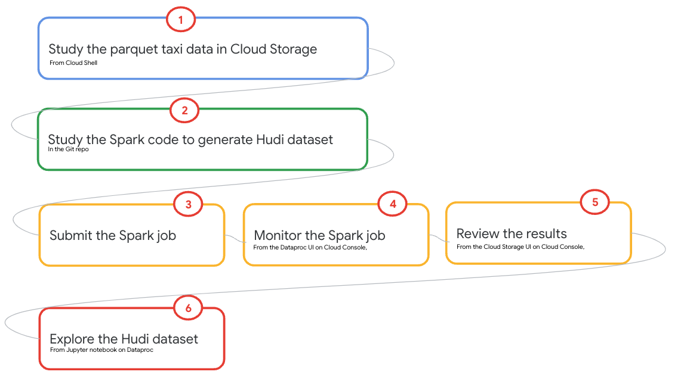
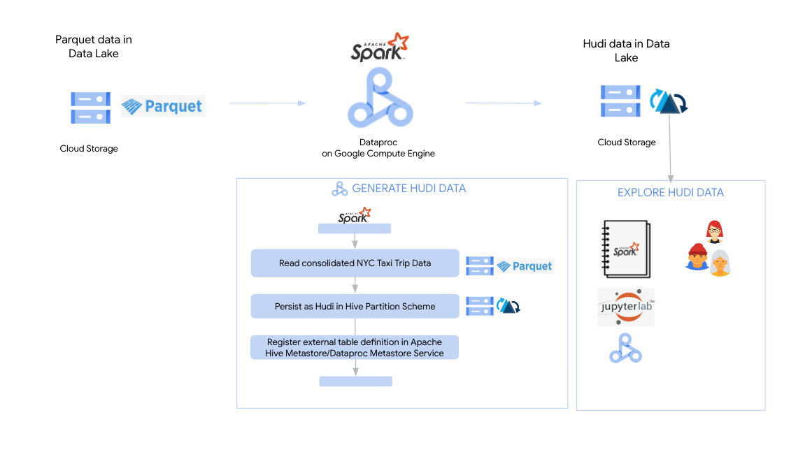
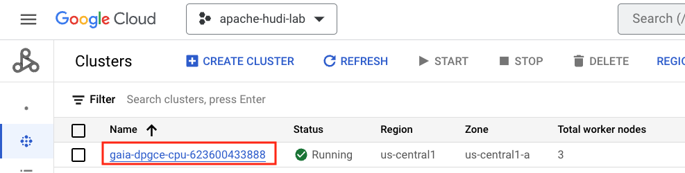
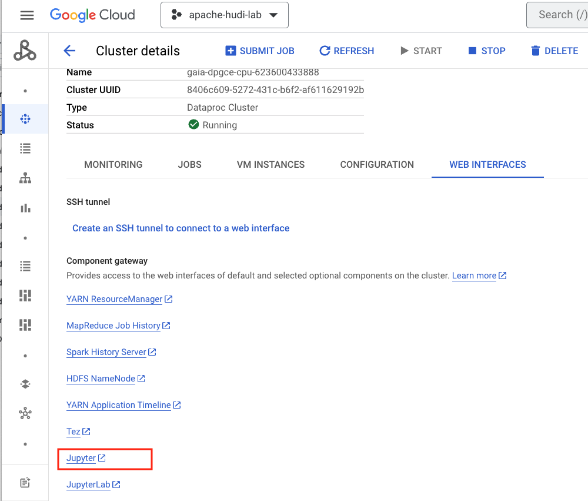
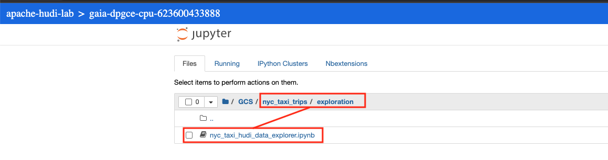

# Module 3: Generate Hudi data for the lab

In this module we will generate Hudi (base) data for the lab, based off of the Parquet data from the previous module and we will persist to our data lake in Cloud Storage.

We will do the data generation via a PySpark script that is pre-created and available in this repo, (and in your cloud storage code bucket), and then explore the Hudi dataset from a pre-created Dataproc Jupyter notebook attached to your cluster. The script also creates an external table defintion on the Hudi dataset in Dataproc Metastore (Apache Hive Metastore). There are some sample Spark SQL queries to explore the data in the notebook. We will generate two types of Hudi tables (datasets) - Copy on Write and Merge on Read - which we will get into in Module 9 notebooks. 

**Prerequisite:** <br>
Successful completion of prior module


<hr>

## Lab Module Goals

Fundamentaly, this module covers creating a Hudi dataset of NYC taxi trip data available in Cloud Storage as a Parquet dataset. The following are implicit. The lab also introduces Jupyter Spark notebooks on Dataproc on Compute Engine if unfamiliar.

## Lab Module Flow

   
<br><br>

## Lab Module Solution Architecture 

   
<br><br>
   
## Lab Module Duration 
60 minutes or less.

<hr>

## 1. About the data in Parquet

NYC (yellow and green) taxi trip data in Parquet in Cloud Storage. You can review the file listing from Cloud Shell with the commands below-


### 1.1. The layout
```
# Variables
PROJECT_ID=`gcloud config list --format "value(core.project)" 2>/dev/null`
PROJECT_NBR=`gcloud projects describe $PROJECT_ID | grep projectNumber | cut -d':' -f2 |  tr -d "'" | xargs`
DATA_BUCKET_PARQUET_FQP="gs://gaia_data_bucket-$PROJECT_NBR/nyc-taxi-trips-parquet"

# List some files to get a view of the hive paritioning scheme
gsutil ls -r $DATA_BUCKET_PARQUET_FQP | head -20
```
Author's output:
```
INFORMATIONAL
gsutil ls -r $DATA_BUCKET_PARQUET_FQP | head -20
gs://gaia_data_bucket-623600433888/nyc-taxi-trips-parquet/:
gs://gaia_data_bucket-623600433888/nyc-taxi-trips-parquet/
gs://gaia_data_bucket-623600433888/nyc-taxi-trips-parquet/_SUCCESS

gs://gaia_data_bucket-623600433888/nyc-taxi-trips-parquet/trip_date=2019-01-01/:
gs://gaia_data_bucket-623600433888/nyc-taxi-trips-parquet/trip_date=2019-01-01/
gs://gaia_data_bucket-623600433888/nyc-taxi-trips-parquet/trip_date=2019-01-01/part-00000-48452727-9f07-44d4-88e9-566c88d27e3e.c000.snappy.parquet
gs://gaia_data_bucket-623600433888/nyc-taxi-trips-parquet/trip_date=2019-01-01/part-00001-48452727-9f07-44d4-88e9-566c88d27e3e.c000.snappy.parquet
gs://gaia_data_bucket-623600433888/nyc-taxi-trips-parquet/trip_date=2019-01-01/part-00002-48452727-9f07-44d4-88e9-566c88d27e3e.c000.snappy.parquet
gs://gaia_data_bucket-623600433888/nyc-taxi-trips-parquet/trip_date=2019-01-01/part-00003-48452727-9f07-44d4-88e9-566c88d27e3e.c000.snappy.parquet
gs://gaia_data_bucket-623600433888/nyc-taxi-trips-parquet/trip_date=2019-01-01/part-00004-48452727-9f07-44d4-88e9-566c88d27e3e.c000.snappy.parquet
gs://gaia_data_bucket-623600433888/nyc-taxi-trips-parquet/trip_date=2019-01-01/part-00005-48452727-9f07-44d4-88e9-566c88d27e3e.c000.snappy.parquet
gs://gaia_data_bucket-623600433888/nyc-taxi-trips-parquet/trip_date=2019-01-01/part-00006-48452727-9f07-44d4-88e9-566c88d27e3e.c000.snappy.parquet
gs://gaia_data_bucket-623600433888/nyc-taxi-trips-parquet/....
```

### 1.2. The number of files
Number of files
```
gsutil ls -r $DATA_BUCKET_PARQUET_FQP | wc -l
```

Author's output: 130,514

### 1.3. The size of the data
```
gsutil du -sh gs://gaia_data_bucket-$PROJECT_NBR
```

Author's output: ~9 GB 

<hr>

## 2. Generate a Hudi Copy-On-Write(CoW) dataset in Cloud Storage

### 2.1. Review the source code

Review the source code available at this [link](../01-scripts/pyspark/nyc_taxi_trips/nyc_taxi_data_generator_hudi.py)<br>

### 2.2. Run the following script in Cloud Shell

This Dataproc can be tuned further for performance.
```
# Variables
PROJECT_ID=`gcloud config list --format "value(core.project)" 2>/dev/null`
PROJECT_NBR=`gcloud projects describe $PROJECT_ID | grep projectNumber | cut -d':' -f2 |  tr -d "'" | xargs`
UMSA_FQN="gaia-lab-sa@$PROJECT_ID.iam.gserviceaccount.com"
DPGCE_CLUSTER_NM="gaia-dpgce-cpu-$PROJECT_NBR"
CODE_BUCKET="gs://gaia_code_bucket-$PROJECT_NBR/pyspark/nyc_taxi_trips"
DATA_BUCKET_PARQUET_FQP="gs://gaia_data_bucket-$PROJECT_NBR/nyc-taxi-trips-parquet"
DATA_BUCKET_HUDI_FQP="gs://gaia_data_bucket-$PROJECT_NBR/nyc-taxi-trips-hudi-cow"
DATAPROC_LOCATION="us-central1"

# Delete any data from a prior run
gsutil rm -r ${DATA_BUCKET_HUDI_FQP}/

# Persist NYC Taxi trips to Cloud Storage in Parquet
gcloud dataproc jobs submit pyspark $CODE_BUCKET/nyc_taxi_data_generator_hudi.py \
--cluster $DPGCE_CLUSTER_NM \
--id nyc_taxi_data_generator_hudi_$RANDOM \
--region $DATAPROC_LOCATION \
--project $PROJECT_ID \
--properties "spark.executor.memory=6g" \
--  --hudiTableType="cow" --peristencePathInput="$DATA_BUCKET_PARQUET_FQP" --peristencePathOutput="$DATA_BUCKET_HUDI_FQP" 
```


<hr>

## 3. Review the persisted data layout & details in Cloud Storage

### 3.1. The layout

Run this in Cloud Shell-
```
# Variables
PROJECT_ID=`gcloud config list --format "value(core.project)" 2>/dev/null`
PROJECT_NBR=`gcloud projects describe $PROJECT_ID | grep projectNumber | cut -d':' -f2 |  tr -d "'" | xargs`
DATA_BUCKET_HUDI_FQP="gs://gaia_data_bucket-$PROJECT_NBR/nyc-taxi-trips-hudi-cow"

# List some files to get a view of the hive paritioning scheme
gsutil ls $DATA_BUCKET_HUDI_FQP/ | head -10

```

Author's output:
```
INFORMATIONAL
gs://gaia_data_bucket-623600433888/nyc-taxi-trips-hudi-cow/
gs://gaia_data_bucket-623600433888/nyc-taxi-trips-hudi-cow/.hoodie/
gs://gaia_data_bucket-623600433888/nyc-taxi-trips-hudi-cow/partition_path=2019-01-01/
gs://gaia_data_bucket-623600433888/nyc-taxi-trips-hudi-cow/partition_path=2019-01-02/
gs://gaia_data_bucket-623600433888/nyc-taxi-trips-hudi-cow/partition_path=2019-01-03/
gs://gaia_data_bucket-623600433888/nyc-taxi-trips-hudi-cow/partition_path=2019-01-04/
gs://gaia_data_bucket-623600433888/nyc-taxi-trips-hudi-cow/partition_path=2019-01-05/
gs://gaia_data_bucket-623600433888/nyc-taxi-trips-hudi-cow/partition_path=2019-01-06/
gs://gaia_data_bucket-623600433888/nyc-taxi-trips-hudi-cow/partition_path=2019-01-07/
...
```

### 3.2. The number of Hudi files

Number of files (all inclusive - metadata as well)
```
gsutil ls -r $DATA_BUCKET_HUDI_FQP | wc -l
```

Author's output: 
7832<br>
(versus 130,514 for Parquet format)<br>
This is due to file-sizing done by Hudi out of the box, where it mitigates small files issue by aut-compacting while persisting.

### 3.3. The size of the data
No compression codec was explicitly specified.
The Hudi dataset is gzip compressed  by default.
(versus Parquet - compressed with snappy)
```
gsutil du -sh $DATA_BUCKET_HUDI_FQP
```

Author's output: 
6.35 GB
(versus ~9 GB of (snappy compressed) Parquet)<br>

### 3.4. The metadata

We will learn more about the metadata in the module 9
```
gsutil ls -r $DATA_BUCKET_HUDI_FQP/.hoodie
```

The author's output-
```
INFORMATIONAL
gs://gaia_data_bucket-623600433888/nyc-taxi-trips-hudi-cow/.hoodie/:
gs://gaia_data_bucket-623600433888/nyc-taxi-trips-hudi-cow/.hoodie/
gs://gaia_data_bucket-623600433888/nyc-taxi-trips-hudi-cow/.hoodie/20230728224649726.commit
gs://gaia_data_bucket-623600433888/nyc-taxi-trips-hudi-cow/.hoodie/20230728224649726.commit.requested
gs://gaia_data_bucket-623600433888/nyc-taxi-trips-hudi-cow/.hoodie/20230728224649726.inflight
gs://gaia_data_bucket-623600433888/nyc-taxi-trips-hudi-cow/.hoodie/20230728230501192.commit
gs://gaia_data_bucket-623600433888/nyc-taxi-trips-hudi-cow/.hoodie/20230728230501192.commit.requested
gs://gaia_data_bucket-623600433888/nyc-taxi-trips-hudi-cow/.hoodie/20230728230501192.inflight
gs://gaia_data_bucket-623600433888/nyc-taxi-trips-hudi-cow/.hoodie/20230728231440980.commit
gs://gaia_data_bucket-623600433888/nyc-taxi-trips-hudi-cow/.hoodie/20230728231440980.commit.requested
gs://gaia_data_bucket-623600433888/nyc-taxi-trips-hudi-cow/.hoodie/20230728231440980.inflight
gs://gaia_data_bucket-623600433888/nyc-taxi-trips-hudi-cow/.hoodie/20230728232347060.commit
gs://gaia_data_bucket-623600433888/nyc-taxi-trips-hudi-cow/.hoodie/20230728232347060.commit.requested
gs://gaia_data_bucket-623600433888/nyc-taxi-trips-hudi-cow/.hoodie/20230728232347060.inflight
gs://gaia_data_bucket-623600433888/nyc-taxi-trips-hudi-cow/.hoodie/hoodie.properties

gs://gaia_data_bucket-623600433888/nyc-taxi-trips-hudi-cow/.hoodie/.aux/:
gs://gaia_data_bucket-623600433888/nyc-taxi-trips-hudi-cow/.hoodie/.aux/

gs://gaia_data_bucket-623600433888/nyc-taxi-trips-hudi-cow/.hoodie/.aux/.bootstrap/:

gs://gaia_data_bucket-623600433888/nyc-taxi-trips-hudi-cow/.hoodie/.aux/.bootstrap/.fileids/:
gs://gaia_data_bucket-623600433888/nyc-taxi-trips-hudi-cow/.hoodie/.aux/.bootstrap/.fileids/

gs://gaia_data_bucket-623600433888/nyc-taxi-trips-hudi-cow/.hoodie/.aux/.bootstrap/.partitions/:
gs://gaia_data_bucket-623600433888/nyc-taxi-trips-hudi-cow/.hoodie/.aux/.bootstrap/.partitions/

gs://gaia_data_bucket-623600433888/nyc-taxi-trips-hudi-cow/.hoodie/.schema/:
gs://gaia_data_bucket-623600433888/nyc-taxi-trips-hudi-cow/.hoodie/.schema/

gs://gaia_data_bucket-623600433888/nyc-taxi-trips-hudi-cow/.hoodie/.temp/:
gs://gaia_data_bucket-623600433888/nyc-taxi-trips-hudi-cow/.hoodie/.temp/

gs://gaia_data_bucket-623600433888/nyc-taxi-trips-hudi-cow/.hoodie/archived/:
gs://gaia_data_bucket-623600433888/nyc-taxi-trips-hudi-cow/.hoodie/archived/

gs://gaia_data_bucket-623600433888/nyc-taxi-trips-hudi-cow/.hoodie/metadata/:
gs://gaia_data_bucket-623600433888/nyc-taxi-trips-hudi-cow/.hoodie/metadata/

gs://gaia_data_bucket-623600433888/nyc-taxi-trips-hudi-cow/.hoodie/metadata/.hoodie/:
gs://gaia_data_bucket-623600433888/nyc-taxi-trips-hudi-cow/.hoodie/metadata/.hoodie/
gs://gaia_data_bucket-623600433888/nyc-taxi-trips-hudi-cow/.hoodie/metadata/.hoodie/00000000000000.deltacommit
gs://gaia_data_bucket-623600433888/nyc-taxi-trips-hudi-cow/.hoodie/metadata/.hoodie/00000000000000.deltacommit.inflight
gs://gaia_data_bucket-623600433888/nyc-taxi-trips-hudi-cow/.hoodie/metadata/.hoodie/00000000000000.deltacommit.requested
gs://gaia_data_bucket-623600433888/nyc-taxi-trips-hudi-cow/.hoodie/metadata/.hoodie/20230728224649726.deltacommit
gs://gaia_data_bucket-623600433888/nyc-taxi-trips-hudi-cow/.hoodie/metadata/.hoodie/20230728224649726.deltacommit.inflight
gs://gaia_data_bucket-623600433888/nyc-taxi-trips-hudi-cow/.hoodie/metadata/.hoodie/20230728224649726.deltacommit.requested
gs://gaia_data_bucket-623600433888/nyc-taxi-trips-hudi-cow/.hoodie/metadata/.hoodie/20230728230501192.deltacommit
gs://gaia_data_bucket-623600433888/nyc-taxi-trips-hudi-cow/.hoodie/metadata/.hoodie/20230728230501192.deltacommit.inflight
gs://gaia_data_bucket-623600433888/nyc-taxi-trips-hudi-cow/.hoodie/metadata/.hoodie/20230728230501192.deltacommit.requested
gs://gaia_data_bucket-623600433888/nyc-taxi-trips-hudi-cow/.hoodie/metadata/.hoodie/20230728231440980.deltacommit
gs://gaia_data_bucket-623600433888/nyc-taxi-trips-hudi-cow/.hoodie/metadata/.hoodie/20230728231440980.deltacommit.inflight
gs://gaia_data_bucket-623600433888/nyc-taxi-trips-hudi-cow/.hoodie/metadata/.hoodie/20230728231440980.deltacommit.requested
gs://gaia_data_bucket-623600433888/nyc-taxi-trips-hudi-cow/.hoodie/metadata/.hoodie/20230728232347060.deltacommit
gs://gaia_data_bucket-623600433888/nyc-taxi-trips-hudi-cow/.hoodie/metadata/.hoodie/20230728232347060.deltacommit.inflight
gs://gaia_data_bucket-623600433888/nyc-taxi-trips-hudi-cow/.hoodie/metadata/.hoodie/20230728232347060.deltacommit.requested
gs://gaia_data_bucket-623600433888/nyc-taxi-trips-hudi-cow/.hoodie/metadata/.hoodie/hoodie.properties

gs://gaia_data_bucket-623600433888/nyc-taxi-trips-hudi-cow/.hoodie/metadata/.hoodie/.aux/:
gs://gaia_data_bucket-623600433888/nyc-taxi-trips-hudi-cow/.hoodie/metadata/.hoodie/.aux/

gs://gaia_data_bucket-623600433888/nyc-taxi-trips-hudi-cow/.hoodie/metadata/.hoodie/.aux/.bootstrap/:

gs://gaia_data_bucket-623600433888/nyc-taxi-trips-hudi-cow/.hoodie/metadata/.hoodie/.aux/.bootstrap/.fileids/:
gs://gaia_data_bucket-623600433888/nyc-taxi-trips-hudi-cow/.hoodie/metadata/.hoodie/.aux/.bootstrap/.fileids/

gs://gaia_data_bucket-623600433888/nyc-taxi-trips-hudi-cow/.hoodie/metadata/.hoodie/.aux/.bootstrap/.partitions/:
gs://gaia_data_bucket-623600433888/nyc-taxi-trips-hudi-cow/.hoodie/metadata/.hoodie/.aux/.bootstrap/.partitions/

gs://gaia_data_bucket-623600433888/nyc-taxi-trips-hudi-cow/.hoodie/metadata/.hoodie/.heartbeat/:
gs://gaia_data_bucket-623600433888/nyc-taxi-trips-hudi-cow/.hoodie/metadata/.hoodie/.heartbeat/

gs://gaia_data_bucket-623600433888/nyc-taxi-trips-hudi-cow/.hoodie/metadata/.hoodie/.schema/:
gs://gaia_data_bucket-623600433888/nyc-taxi-trips-hudi-cow/.hoodie/metadata/.hoodie/.schema/

gs://gaia_data_bucket-623600433888/nyc-taxi-trips-hudi-cow/.hoodie/metadata/.hoodie/.temp/:
gs://gaia_data_bucket-623600433888/nyc-taxi-trips-hudi-cow/.hoodie/metadata/.hoodie/.temp/

gs://gaia_data_bucket-623600433888/nyc-taxi-trips-hudi-cow/.hoodie/metadata/.hoodie/archived/:
gs://gaia_data_bucket-623600433888/nyc-taxi-trips-hudi-cow/.hoodie/metadata/.hoodie/archived/

gs://gaia_data_bucket-623600433888/nyc-taxi-trips-hudi-cow/.hoodie/metadata/files/:
gs://gaia_data_bucket-623600433888/nyc-taxi-trips-hudi-cow/.hoodie/metadata/files/
gs://gaia_data_bucket-623600433888/nyc-taxi-trips-hudi-cow/.hoodie/metadata/files/.files-0000_00000000000000.log.1_0-0-0
gs://gaia_data_bucket-623600433888/nyc-taxi-trips-hudi-cow/.hoodie/metadata/files/.files-0000_00000000000000.log.1_0-12-1565
gs://gaia_data_bucket-623600433888/nyc-taxi-trips-hudi-cow/.hoodie/metadata/files/.files-0000_00000000000000.log.2_0-30-15664
gs://gaia_data_bucket-623600433888/nyc-taxi-trips-hudi-cow/.hoodie/metadata/files/.files-0000_00000000000000.log.3_0-50-28640
gs://gaia_data_bucket-623600433888/nyc-taxi-trips-hudi-cow/.hoodie/metadata/files/.files-0000_00000000000000.log.4_0-73-41737
gs://gaia_data_bucket-623600433888/nyc-taxi-trips-hudi-cow/.hoodie/metadata/files/.files-0000_00000000000000.log.5_0-99-54754

gs://gaia_data_bucket-623600433888/nyc-taxi-trips-hudi-cow/.hoodie/metadata/files/.hoodie_partition_metadata

```


<hr>

## 4. Explore the dataset in a Jupyter notebook
Navigate to Jupyter on Dataproc and run the notebook nyc_taxi_hudi_data_generator.ipynb as shown below-

   
<br><br>

   
<br><br>

   
<br><br>

   
<br><br>


<hr>

## 5. Taxi trip count
This is from the notebook.<br><br>

Hudi dataset-
```
+---------+------------+
|trip_year|trip_count  |
+---------+------------+
|     2019|  90,897,542|
|     2020|  26,369,825|
|     2021|  31,972,637|
|     2022|  37,023,925|
+---------+------------+
```


<hr>

## 6. Generate a Hudi Merge-On-Read(MoR) dataset in Cloud Storage

### 6.1. Review the source code

The source code is available at this [link](../01-scripts/pyspark/nyc_taxi_trips/nyc_taxi_data_generator_hudi.py)<br>

### 6.2. Run the following script in Cloud Shell

This Dataproc can be tuned further for performance.
```
# Variables
PROJECT_ID=`gcloud config list --format "value(core.project)" 2>/dev/null`
PROJECT_NBR=`gcloud projects describe $PROJECT_ID | grep projectNumber | cut -d':' -f2 |  tr -d "'" | xargs`
UMSA_FQN="gaia-lab-sa@$PROJECT_ID.iam.gserviceaccount.com"
DPGCE_CLUSTER_NM="gaia-dpgce-cpu-$PROJECT_NBR"
CODE_BUCKET="gs://gaia_code_bucket-$PROJECT_NBR/pyspark/nyc_taxi_trips"
DATA_BUCKET_PARQUET_FQP="gs://gaia_data_bucket-$PROJECT_NBR/nyc-taxi-trips-parquet"
DATA_BUCKET_HUDI_FQP="gs://gaia_data_bucket-$PROJECT_NBR/nyc-taxi-trips-hudi-mor"
DATAPROC_LOCATION="us-central1"

# Delete any data from a prior run
gsutil rm -r ${DATA_BUCKET_HUDI_FQP}/

# Persist NYC Taxi trips to Cloud Storage in Parquet
gcloud dataproc jobs submit pyspark $CODE_BUCKET/nyc_taxi_data_generator_hudi.py \
--cluster $DPGCE_CLUSTER_NM \
--id nyc_taxi_data_generator_hudi_$RANDOM \
--region $DATAPROC_LOCATION \
--project $PROJECT_ID \
--properties "spark.executor.memory=6g" \
--  --hudiTableType="mor" --peristencePathInput="$DATA_BUCKET_PARQUET_FQP" --peristencePathOutput="$DATA_BUCKET_HUDI_FQP" 
```


<hr>

This concludes module 3, please proceed to the [next module](Module-04.md).

