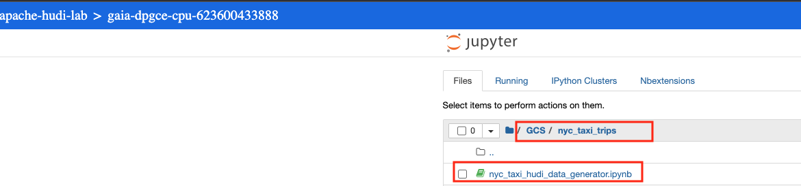
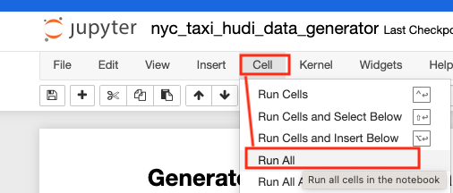

# Module 3: Generate Hudi data for the lab

In this module and next, we will generate Hudi (base) data for the lab, based off of the Parquet data from the previous module and we will persist to our data lake in Cloud Storage.

We will do the data generation in Dataproc Jupyter Notebooks. A pre-created notebook is already attached to your cluster. We will merely run the same. The notebook also creates an external table on the Hudi dataset in Dataproc Metastore (Apache Hive Metastore). There are some sample Spark SQL queries to explore the data in the notebook.
   
**Lab Module Duration:** <br>
30 minutes 

**Prerequisite:** <br>
Successful completion of prior module

<hr>

## 1. About the data in Parquet

NYC (yellow and green) taxi trip data in Parquet in Cloud Storage. The data is **deliberately** a tad over-partitioned considering the small size of the overall dataset, and with small files to show metadata acceleration made possible with BigLake. You can review the file listing from Cloud Shell with the commands below-


### 1.1. The layout
```
# Variables
PROJECT_ID=`gcloud config list --format "value(core.project)" 2>/dev/null`
PROJECT_NBR=`gcloud projects describe $PROJECT_ID | grep projectNumber | cut -d':' -f2 |  tr -d "'" | xargs`
DATA_BUCKET_PARQUET_FQP="gs://gaia_data_bucket-$PROJECT_NBR/nyc-taxi-trips-parquet"


# List some files to get a view of the hive paritioning scheme
gsutil ls -r $DATA_BUCKET_PARQUET_FQP | head -20
```
Author's output:
```
INFORMATIONAL
gs://gaia_data_bucket-623600433888/nyc-taxi-trips-parquet/:
gs://gaia_data_bucket-623600433888/nyc-taxi-trips-parquet/
gs://gaia_data_bucket-623600433888/nyc-taxi-trips-parquet/_SUCCESS

gs://gaia_data_bucket-623600433888/nyc-taxi-trips-parquet/trip_year=2019/:
gs://gaia_data_bucket-623600433888/nyc-taxi-trips-parquet/trip_year=2019/

gs://gaia_data_bucket-623600433888/nyc-taxi-trips-parquet/trip_year=2019/trip_month=1/:
gs://gaia_data_bucket-623600433888/nyc-taxi-trips-parquet/trip_year=2019/trip_month=1/

gs://gaia_data_bucket-623600433888/nyc-taxi-trips-parquet/trip_year=2019/trip_month=1/trip_day=1/:
gs://gaia_data_bucket-623600433888/nyc-taxi-trips-parquet/trip_year=2019/trip_month=1/trip_day=1/
gs://gaia_data_bucket-623600433888/nyc-taxi-trips-parquet/trip_year=2019/trip_month=1/trip_day=1/part-00000-7c5db3b2-8584-458f-a1df-471740bd4750.c000.snappy.parquet
gs://gaia_data_bucket-623600433888/nyc-taxi-trips-parquet/trip_year=2019/trip_month=1/trip_day=1/part-00001-7c5db3b2-8584-458f-a1df-471740bd4750.c000.snappy.parquet
gs://gaia_data_bucket-623600433888/nyc-taxi-trips-parquet/trip_year=2019/trip_month=1/trip_day=1/part-00002-7c5db3b2-8584-458f-a1df-471740bd4750.c000.snappy.parquet
gs://gaia_data_bucket-623600433888/nyc-taxi-trips-parquet/trip_year=2019/trip_month=1/trip_day=1/part-00003-7c5db3b2-8584-458f-a1df-471740bd4750.c000.snappy.parquet
gs://gaia_data_bucket-623600433888/nyc-taxi-trips-parquet/trip_year=2019/trip_month=1/trip_day=1/part-00004-7c5db3b2-8584-458f-a1df-471740bd4750.c000.snappy.parquet
gs://gaia_data_bucket-623600433888/nyc-taxi-trips-parquet/trip_year=2019/trip_month=1/trip_day=1/part-00005-7c5db3b2-8584-458f-a1df-471740bd4750.c000.snappy.parquet
gs://gaia_data_bucket-623600433888/nyc-taxi-trips-parquet/trip_year=2019/trip_month=1/trip_day=1/part-00006-7c5db3b2-8584-458f-a1df-471740bd4750.c000.snappy.parquet
gs://gaia_data_bucket-623600433888/nyc-taxi-trips-parquet/trip_year=2019/trip_month=1/trip_day=1/part-00007-7c5db3b2-8584-458f-a1df-471740bd4750.c000.snappy.parquet
```

### 1.2. The number of files
Number of files
```
gsutil ls -r $DATA_BUCKET_PARQUET_FQP | wc -l
```

Author's output: 127,018

### 1.3. The size of the data
```
gsutil du -sh gs://gaia_data_bucket-$PROJECT_NBR
```

Author's output: 8.07 GiB

<hr>

## 3. Generate a Hudi (CoW) dataset in Cloud Storage

Navigate to Jupyter on Dataproc and run ththe notebook nyc_taxi_hudi_data_generator.ipynb as shown below-

   
<br><br>

   
<br><br>

   
<br><br>

   
<br><br>


## 4. Review the persisted data layout & details in Cloud Storage

### 4.1. The layout

Run this in Cloud Shell-
```
# Variables
PROJECT_ID=`gcloud config list --format "value(core.project)" 2>/dev/null`
PROJECT_NBR=`gcloud projects describe $PROJECT_ID | grep projectNumber | cut -d':' -f2 |  tr -d "'" | xargs`
DATA_BUCKET_HUDI_FQP="gs://gaia_data_bucket-$PROJECT_NBR/nyc-taxi-trips-hudi"


# List some files to get a view of the hive paritioning scheme
gsutil ls -r $DATA_BUCKET_HUDI_FQP/ | head -10
```

Author's output:
```
INFORMATIONAL
gs://gaia_data_bucket-623600433888/nyc-taxi-trips-hudi/
gs://gaia_data_bucket-623600433888/nyc-taxi-trips-hudi/.hoodie/
gs://gaia_data_bucket-623600433888/nyc-taxi-trips-hudi/trip_year=2019/
gs://gaia_data_bucket-623600433888/nyc-taxi-trips-hudi/trip_year=2020/
gs://gaia_data_bucket-623600433888/nyc-taxi-trips-hudi/trip_year=2021/
gs://gaia_data_bucket-623600433888/nyc-taxi-trips-hudi/trip_year=2022/
```

### 4.2. The number of Hudi files

Number of files
```
gsutil ls -r $DATA_BUCKET_HUDI_FQP | wc -l
```

Author's output: 
7,341<br>
(versus 127,018 for Parquet format)<br>
We will learn about the disparity in module 8

### 4.3. The size of the data
```
gsutil du -sh $DATA_BUCKET_HUDI_FQP
```

Author's output: 
1.26 GiB 
(versus 8 GiB of Parquet)<br>
We will learn about the disparity in module 8

### 4.4. The record count

```
Hudi format:
+---------+----------+-----------+
|         |    Hudi  |  Parquet  |    
+---------+----------+-----------+
|trip_year|trip_count| trip_count|
+---------+----------+-----------+
|     2019| 8,023,712| 90,897,542|
|     2020| 4,179,576| 26,369,825|
|     2022| 4,022,129| 31,972,637|
|     2021| 4,713,998| 37,023,925| 
+---------+----------+-----------+
We will learn about the disparity in module 8<br>
```

### 4.4. The metadata

```
gsutil ls -r $DATA_BUCKET_HUDI_FQP/.hoodie
```

The author's output-
```
INFORMATIONAL
gs://gaia_data_bucket-623600433888/nyc-taxi-trips-hudi/.hoodie/:
gs://gaia_data_bucket-623600433888/nyc-taxi-trips-hudi/.hoodie/
gs://gaia_data_bucket-623600433888/nyc-taxi-trips-hudi/.hoodie/20230629171034889.commit
gs://gaia_data_bucket-623600433888/nyc-taxi-trips-hudi/.hoodie/20230629171034889.commit.requested
gs://gaia_data_bucket-623600433888/nyc-taxi-trips-hudi/.hoodie/20230629171034889.inflight
gs://gaia_data_bucket-623600433888/nyc-taxi-trips-hudi/.hoodie/hoodie.properties

gs://gaia_data_bucket-623600433888/nyc-taxi-trips-hudi/.hoodie/.aux/:
gs://gaia_data_bucket-623600433888/nyc-taxi-trips-hudi/.hoodie/.aux/

gs://gaia_data_bucket-623600433888/nyc-taxi-trips-hudi/.hoodie/.aux/.bootstrap/:

gs://gaia_data_bucket-623600433888/nyc-taxi-trips-hudi/.hoodie/.aux/.bootstrap/.fileids/:
gs://gaia_data_bucket-623600433888/nyc-taxi-trips-hudi/.hoodie/.aux/.bootstrap/.fileids/

gs://gaia_data_bucket-623600433888/nyc-taxi-trips-hudi/.hoodie/.aux/.bootstrap/.partitions/:
gs://gaia_data_bucket-623600433888/nyc-taxi-trips-hudi/.hoodie/.aux/.bootstrap/.partitions/

gs://gaia_data_bucket-623600433888/nyc-taxi-trips-hudi/.hoodie/.schema/:
gs://gaia_data_bucket-623600433888/nyc-taxi-trips-hudi/.hoodie/.schema/

gs://gaia_data_bucket-623600433888/nyc-taxi-trips-hudi/.hoodie/.temp/:
gs://gaia_data_bucket-623600433888/nyc-taxi-trips-hudi/.hoodie/.temp/

gs://gaia_data_bucket-623600433888/nyc-taxi-trips-hudi/.hoodie/archived/:
gs://gaia_data_bucket-623600433888/nyc-taxi-trips-hudi/.hoodie/archived/

gs://gaia_data_bucket-623600433888/nyc-taxi-trips-hudi/.hoodie/metadata/:
gs://gaia_data_bucket-623600433888/nyc-taxi-trips-hudi/.hoodie/metadata/

gs://gaia_data_bucket-623600433888/nyc-taxi-trips-hudi/.hoodie/metadata/.hoodie/:
gs://gaia_data_bucket-623600433888/nyc-taxi-trips-hudi/.hoodie/metadata/.hoodie/
gs://gaia_data_bucket-623600433888/nyc-taxi-trips-hudi/.hoodie/metadata/.hoodie/00000000000000.deltacommit
gs://gaia_data_bucket-623600433888/nyc-taxi-trips-hudi/.hoodie/metadata/.hoodie/00000000000000.deltacommit.inflight
gs://gaia_data_bucket-623600433888/nyc-taxi-trips-hudi/.hoodie/metadata/.hoodie/00000000000000.deltacommit.requested
gs://gaia_data_bucket-623600433888/nyc-taxi-trips-hudi/.hoodie/metadata/.hoodie/20230629171034889.deltacommit
gs://gaia_data_bucket-623600433888/nyc-taxi-trips-hudi/.hoodie/metadata/.hoodie/20230629171034889.deltacommit.inflight
gs://gaia_data_bucket-623600433888/nyc-taxi-trips-hudi/.hoodie/metadata/.hoodie/20230629171034889.deltacommit.requested
gs://gaia_data_bucket-623600433888/nyc-taxi-trips-hudi/.hoodie/metadata/.hoodie/hoodie.properties

gs://gaia_data_bucket-623600433888/nyc-taxi-trips-hudi/.hoodie/metadata/.hoodie/.aux/:
gs://gaia_data_bucket-623600433888/nyc-taxi-trips-hudi/.hoodie/metadata/.hoodie/.aux/

gs://gaia_data_bucket-623600433888/nyc-taxi-trips-hudi/.hoodie/metadata/.hoodie/.aux/.bootstrap/:

gs://gaia_data_bucket-623600433888/nyc-taxi-trips-hudi/.hoodie/metadata/.hoodie/.aux/.bootstrap/.fileids/:
gs://gaia_data_bucket-623600433888/nyc-taxi-trips-hudi/.hoodie/metadata/.hoodie/.aux/.bootstrap/.fileids/

gs://gaia_data_bucket-623600433888/nyc-taxi-trips-hudi/.hoodie/metadata/.hoodie/.aux/.bootstrap/.partitions/:
gs://gaia_data_bucket-623600433888/nyc-taxi-trips-hudi/.hoodie/metadata/.hoodie/.aux/.bootstrap/.partitions/

gs://gaia_data_bucket-623600433888/nyc-taxi-trips-hudi/.hoodie/metadata/.hoodie/.heartbeat/:
gs://gaia_data_bucket-623600433888/nyc-taxi-trips-hudi/.hoodie/metadata/.hoodie/.heartbeat/

gs://gaia_data_bucket-623600433888/nyc-taxi-trips-hudi/.hoodie/metadata/.hoodie/.schema/:
gs://gaia_data_bucket-623600433888/nyc-taxi-trips-hudi/.hoodie/metadata/.hoodie/.schema/

gs://gaia_data_bucket-623600433888/nyc-taxi-trips-hudi/.hoodie/metadata/.hoodie/.temp/:
gs://gaia_data_bucket-623600433888/nyc-taxi-trips-hudi/.hoodie/metadata/.hoodie/.temp/

gs://gaia_data_bucket-623600433888/nyc-taxi-trips-hudi/.hoodie/metadata/.hoodie/archived/:
gs://gaia_data_bucket-623600433888/nyc-taxi-trips-hudi/.hoodie/metadata/.hoodie/archived/

gs://gaia_data_bucket-623600433888/nyc-taxi-trips-hudi/.hoodie/metadata/files/:
gs://gaia_data_bucket-623600433888/nyc-taxi-trips-hudi/.hoodie/metadata/files/
gs://gaia_data_bucket-623600433888/nyc-taxi-trips-hudi/.hoodie/metadata/files/.files-0000_00000000000000.log.1_0-0-0
gs://gaia_data_bucket-623600433888/nyc-taxi-trips-hudi/.hoodie/metadata/files/.files-0000_00000000000000.log.1_0-74-14014
gs://gaia_data_bucket-623600433888/nyc-taxi-trips-hudi/.hoodie/metadata/files/.files-0000_00000000000000.log.2_0-105-24790
gs://gaia_data_bucket-623600433888/nyc-taxi-trips-hudi/.hoodie/metadata/files/.hoodie_partition_metadata

```

<hr>

