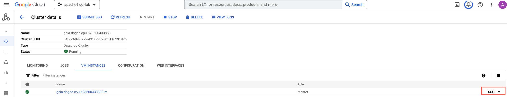
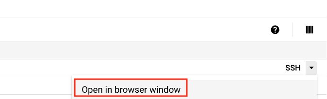
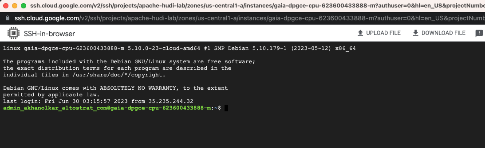
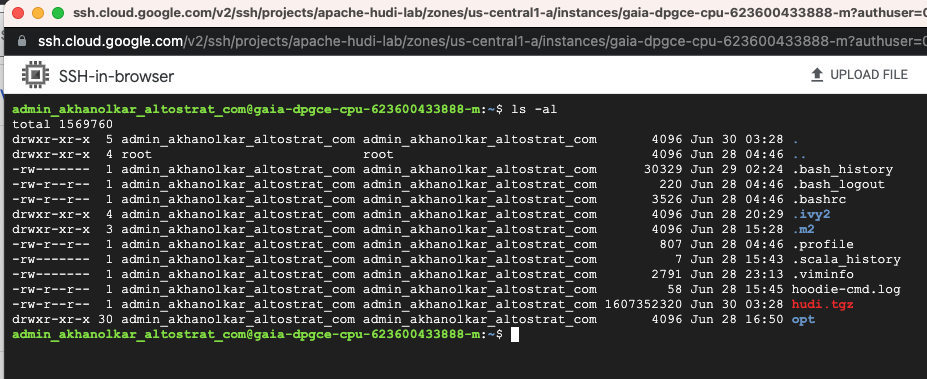

# Module 4: Create BigQuery external tables on Hudi datasets in your data lake

This lab module introduces Apache Hudi tooling for integrating Hudi tables in a data lake on Cloud Storage into BigQuery as external tables.

### Prerequisite for the module
Completion of prior lab modules, including creation of Hudi dataset.

### Lab module duration
15 minutes

<hr>

## 1. Native Apache Hudi integration tooling for BigQuery

### 1.1. About
Apache Hudi offers a BigQuerySyncTool - a utility that reads Hudi metadata of a Hudi table in Cloud Storage, and creates a BigQuery external table on a point-in-time snapshot of the same data. This external table is read only and can be queried using BigQuery SQL from the BigQuery UI and other supported BigQuery querying avenues and uses BigQuery compute under the hood.

Learn more about the tooling in the [Apache Hudi documentation](https://hudi.apache.org/docs/gcp_bigquery/).

### 1.2. Under the hood

The sync tool syncs a Hudi table at a time, and requires running a Spark application. 
Upon launching the app-
1. It creates a manifest file reflecting the latest snapshot of the table, and persists the same in the .hoodie directory of the Hudi dataset.
2. It creates an external table in BigQuery

### 1.3. Querying the Hudi dataset in BigQuery
To query the Hudi dataset, one must query the external table.<br>

### 1.4. Architectural considerations
The manifest is a "point in time" snapshot, therefore the view reflects point in time state of the Hudi dataset. Run the sync tool as frequently as you need to query fresh data

### 1.5. What is takes to use the tooling as it stands

1. Build Hudi from source (requires Java 8)
2. Copy/scp the same to cluster
3. Run the Spark application that uses the BigQuerySyncTool

### 1.6. What's coming in Dataproc

The BigQuerySyncTool will be included as part of the base Dataproc image. 
<br>

<hr>

## 2. Building Hudi from source

### 2.1. Prerequisite

Java 8 and Maven

### 2.2. Steps to build from source 

```
# ........................................................
# Clone Apache Hudi locally
git clone https://github.com/apache/hudi

# ........................................................
# Build from source
cd hudi
mvn clean package -DskipTests -Dspark3.3 -Dscala-2.12

# ........................................................
# Compress Hudi
cd ..
tar -cvzf hudi.tgz hudi
```

<hr>

## 3. scp the tarball to the cluster

Run the command to scp to the cluster

```
PROJECT_ID=`gcloud config list --format "value(core.project)" 2>/dev/null`
PROJECT_NBR=`gcloud projects describe $PROJECT_ID | grep projectNumber | cut -d':' -f2 |  tr -d "'" | xargs`

gcloud compute scp hudi.tgz --zone "us-central1-a" gaia-dpgce-cpu-$PROJECT_NBR-m:~/ --tunnel-through-iap --project "apache-hudi-lab"

```

<hr>

## 4. SSH to the cluster master node

   
<br><br>

   
<br><br>

   
<br><br>

   
<br><br>

<hr>

## 5. Uncompress the Hudi tarball on the master node of the cluster

While logged into the master node on Dataproc, uncompress the Hudi tarball.

```
cd ~
tar -xvzf hudi.tgz
```

<hr>

## 6. Create a properties file on the master node of the cluster

Run this on the master node-
```
cd ~
cp /etc/spark/conf/spark-defaults.conf gaia_hudi_conf
HUDI_PATH=~/hudi/*
echo spark.driver.extraClassPath=$HUDI_PATH >> gaia_hudi_conf
echo spark.executor.extraClassPath=$HUDI_PATH >> gaia_hudi_conf
```

This created a properties file to which we appended Hudi libraries to the Spark driver and executor extraClassPath.

<hr>

## 7. Run the BigQuerySyncTool  on the master node of the cluster


```
PROJECT_ID=`gcloud config list --format "value(core.project)" 2>/dev/null`
PROJECT_NBR=`gcloud projects describe $PROJECT_ID | grep projectNumber | cut -d':' -f2 |  tr -d "'" | xargs`
LOCATION=us-central1

cd ~

spark-submit --master yarn \
--properties-file gaia_hudi_conf \
--packages com.google.cloud:google-cloud-bigquery:2.10.4  \
--class org.apache.hudi.gcp.bigquery.BigQuerySyncTool  \
hudi/packaging/hudi-gcp-bundle/target/hudi-gcp-bundle-0.14.0-SNAPSHOT.jar \
--project-id $PROJECT_ID \
--dataset-name gaia_product_ds \
--dataset-location $LOCATION \
--table nyc_taxi_trips_hudi \
--source-uri gs://gaia_data_bucket-$PROJECT_NBR/nyc-taxi-trips-hudi/trip_year=*  \
--source-uri-prefix gs://gaia_data_bucket-$PROJECT_NBR/nyc-taxi-trips-hudi/ \
--base-path gs://gaia_data_bucket-$PROJECT_NBR/nyc-taxi-trips-hudi/ \
--partitioned-by trip_year,trip_month,trip_year \
--use-bq-manifest-file

```

Author's output-
```
INFORMATIONAL
.....
23/06/30 03:48:43 INFO HoodieBigQuerySyncClient: Manifest External table created.
23/06/30 03:48:43 INFO BigQuerySyncTool: Manifest table creation complete for nyc_taxi_trips_hudi_manifest
23/06/30 03:48:44 INFO HoodieBigQuerySyncClient: External table created using hivepartitioningoptions
23/06/30 03:48:44 INFO BigQuerySyncTool: Versions table creation complete for nyc_taxi_trips_hudi_versions
23/06/30 03:48:44 INFO HoodieBigQuerySyncClient: View created successfully
23/06/30 03:48:44 INFO BigQuerySyncTool: Snapshot view creation complete for nyc_taxi_trips_hudi
23/06/30 03:48:44 INFO BigQuerySyncTool: Sync table complete for nyc_taxi_trips_hudi
```

<hr>

## 8. The Hudi manifest file

A manifest file called latest-snapshot.csv gets created in the .hoodie directory of the Hudi dataset in Cloud Storage in a folder called manifest. It merely has a listing of all the files in the latest Hudi snapshot.<br>

Run this on Cloud Shell-

```
PROJECT_ID=`gcloud config list --format "value(core.project)" 2>/dev/null`
PROJECT_NBR=`gcloud projects describe $PROJECT_ID | grep projectNumber | cut -d':' -f2 |  tr -d "'" | xargs`
HUDI_DATA_LOCATION=gs://gaia_data_bucket-$PROJECT_NBR/nyc-taxi-trips-hudi

gsutil cat $HUDI_DATA_LOCATION/.hoodie/manifest/latest-snapshot.csv | head -2 
```

Author's output-
```
INFORMATIONAL
566cad29-f485-4cdb-8474-015f55728f98-0_1158-95-23078_20230629171034889.parquet
69fcb2aa-17df-45e3-a352-5831d2c55e78-0_1159-95-23079_20230629171034889.parquet
```
<hr>

## 9. Entities created by BigQuerySyncTool in BigQuery

### 9.1. List the entities created by the sync tool
The following lists the entities created in BigQuery-
```
bq ls \
--format=pretty \
--max_results 10 \
$PROJECT_ID:gaia_product_ds
```

Author's output-

```
INFORMATIONAL
+------------------------------+----------+--------+-------------------+------------------+
|           tableId            |   Type   | Labels | Time Partitioning | Clustered Fields |
+------------------------------+----------+--------+-------------------+------------------+
| nyc_taxi_trips_hudi          | EXTERNAL |        |                   |                  |
+------------------------------+----------+--------+-------------------+------------------+
```
<hr>

### 9.2. The hudi manifest table in BigQuery

Run this query in the BigQuery UI and study the DDL- 
```
SELECT ddl FROM gaia_product_ds.INFORMATION_SCHEMA.TABLES WHERE table_name="nyc_taxi_trips_hudi_manifest"
```

Author's output-
```
THIS IS JUST FYI...

CREATE EXTERNAL TABLE `apache-hudi-lab.gaia_product_ds.nyc_taxi_trips_hudi_manifest`
(filename STRING)
OPTIONS(
	format "CSV\",
	uris [\"gs://gaia_data_bucket-623600433888/nyc-taxi-trips-hudi/.hoodie/manifest/*\"]
```

### 9.3. The hudi version table in BigQuery

Run this query in the BigQuery UI and study the DDL- 
```
SELECT ddl FROM gaia_product_ds.INFORMATION_SCHEMA.TABLES WHERE table_name="nyc_taxi_trips_hudi_versions"
```

Author's output-
```
THIS IS JUST FYI...

CREATE EXTERNAL TABLE `apache-hudi-lab.gaia_product_ds.nyc_taxi_trips_hudi_versions`
WITH PARTITION COLUMNS
OPTIONS(
ignore_unknown_values true,
format "PARQUET",
hive_partition_uri_prefix "gs://gaia_data_bucket-623600433888/nyc-taxi-trips-hudi/\",
uris [\"gs://gaia_data_bucket-623600433888/nyc-taxi-trips-hudi/trip_year\"]
```

### 9.4. The hudi view in BigQuery

Run this query in the BigQuery UI and study the DDL- 
```
SELECT view_definition FROM gaia_product_ds.INFORMATION_SCHEMA.VIEWS WHERE table_schema='gaia_product_ds' and table_name="nyc_taxi_trips_hudi"
```
Author's output-
```
THIS IS JUST FYI...

SELECT * FROM `apache-hudi-lab.gaia_product_ds.nyc_taxi_trips_hudi_versions` 
WHERE _hoodie_file_name IN 
(SELECT filename FROM `apache-hudi-lab.gaia_product_ds.nyc_taxi_trips_hudi_manifest`)
```

Effectively every time we want to query the table, a join is executed against the two tables to determine data scope.

<hr>

## 10. Query the view & review the results

Run this query in the BigQuery UI

```
SELECT
  taxi_type,
  SUM(total_amount) AS total_revenue
FROM
  gaia_product_ds.nyc_taxi_trips_hudi
WHERE
  trip_year=2021
  AND trip_month=1
  AND trip_day=31
GROUP BY
  taxi_type
```
<hr>

## 11. Querying fresh data

This requires running the BigQuerySyncTool to update the manifest. Once this manifest is updated, the queries will run against the latest snapshot of the data.

<hr>

## 12. Best practices

1. Dataproc: Avoid connecting to the master node and running the utility, prefer using the Dataproc jobs API instead. This will be much easier when the default image includes hudi in totality.
2. External tables: Prefer Biglake tables for query acceleration, and fine grained access control - row and column level and including masking


<hr>

This concludes the module.
