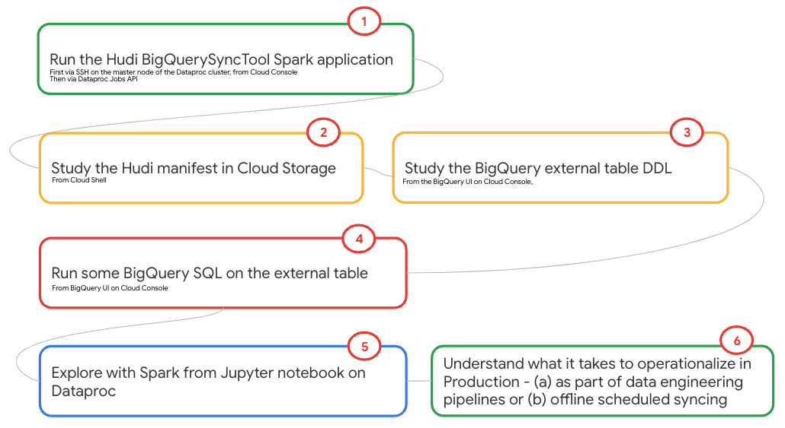
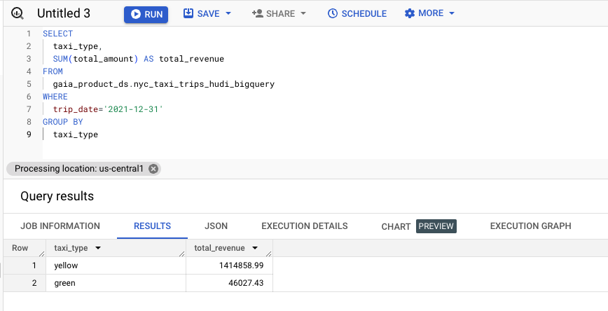
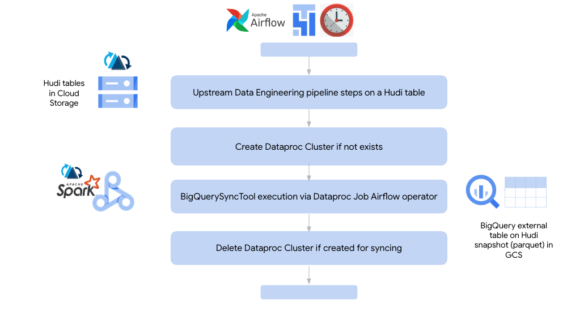
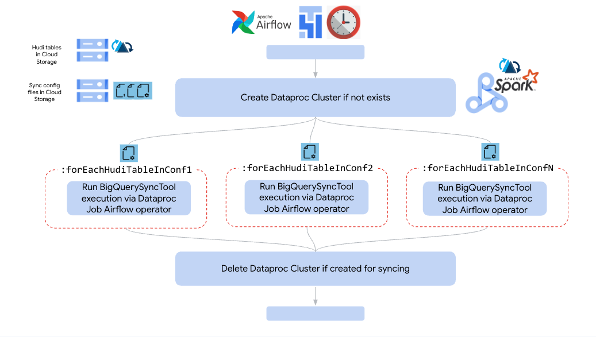

# Module 4: Hudi BigQuerySyncTool for integrating Hudi snapshots into BigQuery
This lab module introduces Apache Hudi tooling for integrating Hudi datasets in a data lake on Cloud Storage into BigQuery as external tables through a simple and practical example.

**Prerequisites:**<br>
Completion of all prior lab modules

<hr>

## Lab Module Goals
Demystify Apache Hudi sync tooling into BigQuery by example.

1. Understand end-to-end, the process to use the Hudi BigQuerySyncTool
2. And architectural considerations
3. And be able to demo the integration
4. Repurpose code/commands for your workloads

<hr>

## 1. Native Apache Hudi integration tooling for BigQuery

### 1.1. About
Apache Hudi offers a BigQuerySyncTool - a uni-directional sync utility that reads Hudi metadata of a Hudi table in Cloud Storage, and creates a BigQuery external table on a point-in-time parquet snapshot of the same data. This external table can be queried using BigQuery SQL from the BigQuery UI and other supported BigQuery querying avenues.

Learn more about the tooling in the [Apache Hudi documentation](https://hudi.apache.org/docs/gcp_bigquery/).

### 1.2. Under the hood

The sync tool syncs a single Hudi table, and requires running a Spark application. <br>
Upon launching, the BigQuerySyncTool-
1. Creates a manifest file reflecting the latest snapshot of the table, and persists the same in the .hoodie directory of the Hudi dataset.
2. Creates an external table in BigQuery

   
<br><br>

### 1.3. Querying the Hudi dataset in BigQuery
Involves just querying the external table.<br>

### 1.4. What is takes to use the tooling as it stands

Simply run the Spark application that uses the BigQuerySyncTool

### 1.5. Architectural considerations
1. The tool syncs just one Hudi dataset/table
2. The manifest is a listing of the Parquet files of the Hudi dataset that constitute a "point in time" snapshot; Therefore the external table reflects the point in time state of the Hudi dataset.
3. Run the BigQuerySyncTool tool as frequently as you need to query fresh data
4. The table persists/remains post the initial run of the BigQuerySyncTool, just the manifest is replaced with each execution
5. If the Hudi schema changes, the external table will reflect the latest schema
6. If the Hudi dataset has deletes/updates, and if Parquet underneath the external tables gets deleted, the query will not fail, it will merely not reflect the data within the files that were deleted
7. JFYI - predicate pushdowns are supported, partition pruning is supported whether you query via BigQuery SQL or via Apache Spark and using the BigQuery Spark connector
8. When you query the external table, follow the typical best practices, such as explicitly calling out the columns you want to select, apply the partition keys for performance and such..
9. Consider including exectuion of the BigQuerySyncTool as part of your data engineering pipelines


### 1.6. Dataproc product update

As of August 5, 2023, the Dataproc on GCE cluster with optional component of Hudi includes Hudi 0.12.3 and the BigQuerySyncTool as part of installation of the component and therefore no longer requiring building Hudi from source. Refer to the [documentation](https://cloud.google.com/dataproc/docs/concepts/components/hudi) for the latest on versions - Dataproc, Spark, Hudi...
<br>

<hr>

## Lab Module Flow

   
<br><br>


## Lab Module Solution Architecture 

### 1. Running the BigQuerySyncTool - from prototype to production 

   
<br><br>

### 2. RECAP: What happens under the hood when the BigQuerySysncTool is run
   
<br><br>

### 3. What else is covered in the lab

   
<br><br>

<hr>

## Software Versions in Dataproc on GCE

Dataproc GCE cluster image: 2.1.18-debian11 <br>
Java: 11.0.19 <br>
Spark: 3.3.0 <br>
Scala: 2.12.14 <br>
Hudi: 0.12.3 <br>

<hr>
   
## Lab Module Duration 
15 minutes or less.

<hr>


## 2. SSH to the cluster master node

   
<br><br>

   
<br><br>

   
<br><br>

<hr>


## 3. Run the BigQuerySyncTool on the master node of the cluster

This is a tactical solution to just explore using the HUDI BigQuerySyncTool. The strategic solution (using Dataproc Jobs API and submitting remotely to the cluster) to run the sync tool covered in teh next section and finally, further on, running via Airflow.

```
PROJECT_ID=`gcloud config list --format "value(core.project)" 2>/dev/null`
PROJECT_NBR=`gcloud projects describe $PROJECT_ID | grep projectNumber | cut -d':' -f2 |  tr -d "'" | xargs`
LOCATION=us-central1

spark-submit --master yarn \
--properties-file gaia_hudi_conf \
--packages com.google.cloud:google-cloud-bigquery:2.10.4  \
--class org.apache.hudi.gcp.bigquery.BigQuerySyncTool  \
/usr/lib/hudi/tools/bq-sync-tool/hudi-gcp-bundle-0.12.3.jar \
--project-id $PROJECT_ID \
--dataset-name gaia_product_ds \
--dataset-location $LOCATION \
--table nyc_taxi_trips_hudi_bigquery \
--source-uri gs://gaia_data_bucket-$PROJECT_NBR/nyc-taxi-trips-hudi-cow/trip_date=*  \
--source-uri-prefix gs://gaia_data_bucket-$PROJECT_NBR/nyc-taxi-trips-hudi-cow/ \
--base-path gs://gaia_data_bucket-$PROJECT_NBR/nyc-taxi-trips-hudi-cow/ \
--partitioned-by trip_date \
--use-bq-manifest-file

```

Author's output-
```
INFORMATIONAL
.....
...
23/07/10 20:50:36 INFO AbstractTableFileSystemView: Building file system view for partition (trip_year=2020/trip_month=12/trip_day=16)
23/07/10 20:50:36 INFO ManifestFileWriter: Writing base file names to manifest file: 2004
23/07/10 20:50:38 INFO HoodieBigQuerySyncClient: External table created using manifest file.
23/07/10 20:50:38 INFO BigQuerySyncTool: Completed table nyc_taxi_trips_hudi_bigquery creation using the manifest file
23/07/10 20:50:38 INFO BigQuerySyncTool: Sync table complete for nyc_taxi_trips_hudi_bigquery
```

<hr>

## 4. Run the BigQuerySyncTool via the Dataproc Jobs API

### TODO for author

<hr>

## 5. The Hudi manifest file created by BigQuerySyncTool 

A manifest file called latest-snapshot.csv gets created in the .hoodie directory of the Hudi dataset in Cloud Storage in a folder called manifest. It merely has a listing of all the files in the latest Hudi snapshot.<br>

   
<br><br>

   
<br><br>

Run this on Cloud Shell to view the listing-

```
PROJECT_ID=`gcloud config list --format "value(core.project)" 2>/dev/null`
PROJECT_NBR=`gcloud projects describe $PROJECT_ID | grep projectNumber | cut -d':' -f2 |  tr -d "'" | xargs`
HUDI_DATA_LOCATION=gs://gaia_data_bucket-$PROJECT_NBR/nyc-taxi-trips-hudi-cow

gsutil cat $HUDI_DATA_LOCATION/.hoodie/absolute-path-manifest/latest-snapshot.csv | head -10 
```

Author's output-
```
INFORMATIONAL
....
gs://gaia_data_bucket-623600433888/nyc-taxi-trips-hudi-cow/trip_date=2019-01-01/3adcbef0-4ca4-4832-af4f-709b7dd38b1b-0_548-19-9510_20230816235910590.parquet
gs://gaia_data_bucket-623600433888/nyc-taxi-trips-hudi-cow/trip_date=2019-01-01/067bef12-69ed-4980-8ce1-25d26bffe4d4-0_549-19-9511_20230816235910590.parquet
gs://gaia_data_bucket-623600433888/nyc-taxi-trips-hudi-cow/trip_date=2019-01-02/6fa562b1-edf0-4a08-a3eb-5f0e6e73fe8f-0_543-19-9505_20230816235910590.parquet
gs://gaia_data_bucket-623600433888/nyc-taxi-trips-hudi-cow/trip_date=2019-01-02/5f175fae-3cf8-40d6-85f0-b725e10e1d7a-0_544-19-9506_20230816235910590.parquet
gs://gaia_data_bucket-623600433888/nyc-taxi-trips-hudi-cow/trip_date=2019-01-03/f4c33c45-68c9-425f-8ef5-98b24d6593b1-0_545-19-9507_20230816235910590.parquet
gs://gaia_data_bucket-623600433888/nyc-taxi-trips-hudi-cow/trip_date=2019-01-03/59bbf3b6-9d84-45c7-9ada-ea3fb62229f5-0_546-19-9508_20230816235910590.parquet
gs://gaia_data_bucket-623600433888/nyc-taxi-trips-hudi-cow/trip_date=2019-01-03/a4405d42-ae41-4478-a61a-22468f1fffb7-0_547-19-9509_20230816235910590.parquet
gs://gaia_data_bucket-623600433888/nyc-taxi-trips-hudi-cow/trip_date=2019-01-04/6e08afe9-7e1d-4024-afe2-7c127d66bcda-0_539-19-9501_20230816235910590.parquet
gs://gaia_data_bucket-623600433888/nyc-taxi-trips-hudi-cow/trip_date=2019-01-04/637a66ff-98b1-4f67-862b-c5b56b37373b-0_537-19-9499_20230816235910590.parquet
gs://gaia_data_bucket-623600433888/nyc-taxi-trips-hudi-cow/trip_date=2019-01-04/78da0616-b8aa-4f51-b34f-f8938b04a477-0_538-19-9500_20230816235910590.parquet
```

<hr>

## 6. Entities created by BigQuerySyncTool in BigQuery

### 6.1. Review the table listing under the dataset gaia_product_ds in the BigQuery UI

   
<br><br>

### 6.2. List the entities created by the sync tool
The following lists the entities created in BigQuery-
```
bq ls \
--format=pretty \
--max_results 10 \
$PROJECT_ID:gaia_product_ds
```

Author's output-

```
INFORMATIONAL
...
+------------------------------+----------+--------+-------------------+------------------+
|     tableId                  |   Type   | Labels | Time Partitioning | Clustered Fields |
+------------------------------+----------+--------+-------------------+------------------+
| nyc_taxi_trips_hudi_bigquery | EXTERNAL |        |                   |                  |
+------------------------------+----------+--------+-------------------+------------------+
```
<hr>

### 6.3. Review the DDL of the external table created by the Hudi BigQuerySyncTool

Run this query in the BigQuery UI and study the DDL- 
```
SELECT ddl FROM gaia_product_ds.INFORMATION_SCHEMA.TABLES WHERE table_name="nyc_taxi_trips_hudi_bigquery"
```

Author's output-
```
THIS IS JUST FYI...

CREATE EXTERNAL TABLE `apache-hudi-lab.gaia_product_ds.nyc_taxi_trips_hudi_bigquery`
WITH PARTITION COLUMNS
OPTIONS(
  format="PARQUET",
  hive_partition_uri_prefix="gs://gaia_data_bucket-623600433888/nyc-taxi-trips-hudi-cow/",
  uris=["gs://gaia_data_bucket-623600433888/nyc-taxi-trips-hudi-cow/.hoodie/absolute-path-manifest/*"],
  file_set_spec_type="NEW_LINE_DELIMITED_MANIFEST"
);
```

   
<br><br>

<hr>

## 7. Query the table & review the results

Run this query in the BigQuery UI

```
SELECT
  taxi_type,
  SUM(total_amount) AS total_revenue
FROM
  gaia_product_ds.nyc_taxi_trips_hudi_bigquery
WHERE
  trip_date='2021-12-31'
GROUP BY
  taxi_type
```

   
<br><br>


<hr>

## 8. Querying fresh data

This requires running the BigQuerySyncTool to generate the latest manifest which overwrites the manifest in GCS, the queries will run against the latest snapshot of the data. 

<hr>

## 9. Consistency considerations

The BigQuerySyncTool merely creates a manifest file on a Hudi snapshot, and a BigQuery external table. The files in the manifest file can get deleted from record deletions, or compaction or for any number of reasons. Queries executed will not fail if files listed in the manifest are physically missing in the Hudi data lake; however, the data will be (understandingly) missing in the query results.

<hr>

## 10. Best practices

1. Dataproc: Avoid connecting to the master node and running the utility, prefer using the Dataproc jobs API instead. 
2. External tables: Prefer Biglake tables for query acceleration, and fine grained access control - row and column level and including masking

<hr>

## 11. Operationalizing for production - option 1: As part of Airflow Data Engineering DAGs

Where freshness of data availability for analytics via BigQuery/BigLake is imperative at the end of data engineering pipeline, it makes sense to run the BigQuerySyncTool as part of a pipeline synchronously. This section covers how to.

### 11.1. Operationalizing - what's involved
For each Hudi table you want to run analytics on in BigQuery, you need to run the BigQuerySyncTool. The following is a pictorial overview of a basic DAG involving one Hudi table, and shows Dataproc cluster creation and deletion just to run the tool. This may not be required if the pipeline already has an ephemeral Dataproc job-scoped cluster. 

   
<br><br>

### 11.2. Airflow stub
The following is a stub that shows what the Airflow action looks like to execute the BigQuerySyncTool-

### TODO
   
<br><br>

### 11.3. Lab exercise: Review and run the Airflow DAG provided below

### TODO by author


<hr>

## 12. Operationalizing for production - option 2: Offline syncing 
When there are tight SLAs to be met, adding the syncing task into the Data Engineering DAG adds delays. In such cases, syncing can be done offline, async. This is a pictorial overview of a pattern (and there are many ways to design this) to run the BigQuerySyncTool in bulk when you have many tables to sync. The author has used config files to help externalize Hudi table listing (and associated sync parameters) and parallelize running the sync tool. Each config file will have a set Hudi tables and the sync parameters will have a Airflow task associated with it that makes repeated calls to the BugQuerySyncTool till all tables in the config file have been synced.


   
<br><br>

<hr>

This concludes the module. Proceed to the [next module](Module-05.md).
