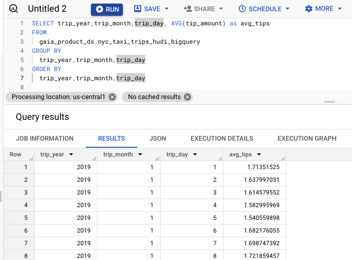

# Module 5: BigLake external tables on Hudi snapshots

## BigLake in a nutshell
BigLake is feature that provides the following capabilities-
1. A readonly  external table abstraction over structured data in Cloud Storage in supported formats.
2. Query acceleration through metadata caching, statistics capture and more
3. Greater security over data lakes through row level security, column level security and data masking made possible with a set of commands
4. Biglake offers decoupling of security - external tables from underlying storage (grant access to table without granting access to data in Cloud Storage)
5. Run queries from BigQuery UI on BigQuery native tables and BigLake tables seamlessly
6. Read/write to BigQuery and BigLake tables seamlessly from Apache Spark on Dataproc
7. Read from BigQuery and BigLake tables seamlessly and visualize with your favorite dashboarding solution
8. Automated scheduled metadata cache refresh per requirement for data freshness
9. Ability to view the metadata cache refresh schedule, alter the same
10. Ability to refresh the metadata cache on demand

<br>

## Value proposition of BigLake for Hudi datasets

Note: BigLake is currently, a read-only external table framework; To add/update/delete data in your Hudi tables, you still need to use technologies such as Apache Spark on Cloud Dataproc. 

- BigLake offers **row, column level security** over Hudi (point-in-time) snapshots of Hudi tables in Cloud Storage
- BigLake **query acceleration** over Hudi (point-in-time) snapshots of Hudi tables in Cloud Storage.

## Architectural considerations
1. You dont need to create a BigQuery and BigLake table each time you run the Hudi BigQuerySyncTool, just the very first time
2. For BigLake tables that are based on Parquet files (as is the case with Hudi snapshots), table statistics are collected during the metadata cache refresh and will improve query plans.
3. Include a process to sync to BigQuery/BigLake metastore, in your data engineering pipelines, for freshest data for querying via BQ SQL, with row and column level security enforced at read time
4. Configure the refresh of BigLake metadata cache based on the need for freshness is a must. Understand the nuances of metadata cache refresh
  
<br>

## 1. Create a BigLake table definition over the Hudi snapshot parquet & manifest in GCS

### 1.1. Generate a SQL for the DDL command to be executed in BigQuery UI (one time activity)

Run this in Cloud Shell-
```
PROJECT_NM=`gcloud config get-value project`
PROJECT_ID=`gcloud config list --format "value(core.project)" 2>/dev/null`
PROJECT_NBR=`gcloud projects describe $PROJECT_ID | grep projectNumber | cut -d':' -f2 |  tr -d "'" | xargs`
LOCATION=us-central1
BQ_CONNECTION_NM=$LOCATION.gaia_bq_connection
HIVE_PARTITION_PREFIX="gs://gaia_data_bucket-$PROJECT_NBR/nyc-taxi-trips-hudi-cow/"
MANIFEST_FQP="${HIVE_PARTITION_PREFIX}.hoodie/absolute-path-manifest/latest-snapshot.csv"


DDL="CREATE OR REPLACE EXTERNAL TABLE gaia_product_ds.nyc_taxi_trips_hudi_biglake WITH PARTITION COLUMNS (trip_year string,trip_month string, trip_day string) WITH CONNECTION \`$PROJECT_NM.$BQ_CONNECTION_NM\` OPTIONS(uris=[\"$MANIFEST_FQP\"],hive_partition_uri_prefix =\"$HIVE_PARTITION_PREFIX\", format=\"PARQUET\",file_set_spec_type=\"NEW_LINE_DELIMITED_MANIFEST\",metadata_cache_mode=\"AUTOMATIC\",max_staleness=INTERVAL '1' DAY );"
echo $DDL
```

Capture the DDL emitted, we will paste this in the BigQuery UI.

   
<br><br>


### 1.2. Run the DDL from the previous step in BigQuery UI to create a Biglake table with bounded staleness

Create the BigLake table by running the DDL in the BigQuery UI.

   
<br><br>

   
<br><br>

<hr>

## 2. Query the Hudi snapshot BigLake table from BigQuery UI

### 2.1. Execute the query
Run the following query in the BigQuery UI-
```
SELECT trip_year,trip_month,trip_day, AVG(tip_amount) as avg_tips
FROM
  gaia_product_ds.nyc_taxi_trips_hudi_biglake
GROUP BY
  trip_year,trip_month,trip_day
ORDER BY
  trip_year,trip_month,trip_day
```

   
<br><br>

### 2.2. Review the execution details

Click on the execution details tab.

   
<br><br>

### 2.3. Review the execution graph

Click on the execution details tab.

   
<br><br>

<hr>

## 3. Run the same query against the Hudi snapshot (plain old) BigQuery (not BigLake) external table

### 3.1. Execute the query
Run the following query in the BigQuery UI-
```
SELECT trip_year,trip_month,trip_day, AVG(tip_amount) as avg_tips
FROM
  gaia_product_ds.nyc_taxi_trips_hudi_bigquery
GROUP BY
  trip_year,trip_month,trip_day
ORDER BY
  trip_year,trip_month,trip_day
```

   
<br><br>

### 3.2. Review the execution details

Click on the execution details tab.

   
<br><br>

<hr>

## 4. The BigLake metadata cache

### 4.1. Understand the metadata cache related architectural considerations

Read the documentation [here](https://cloud.google.com/bigquery/docs/biglake-intro#metadata_caching_for_performance).

### 4.2. Reviewing the metadata cache refresh schedule

Run the query below in the BigQuery UI to see the refresh schedule-
```
SELECT *
FROM `region-us-central1.INFORMATION_SCHEMA.JOBS_BY_PROJECT`
WHERE job_id LIKE '%metadata_cache_refresh%'
AND creation_time > TIMESTAMP_SUB(CURRENT_TIMESTAMP(), INTERVAL 6 HOUR)
ORDER BY start_time DESC
LIMIT 10;
```

   
<br><br>

### 4.3. Triggering metadata cache refresh on-demand

If you have unpredictble needs for data freshness, you may be best served with on-demand metadata cache refresh, versus AUTOMATIC as demonstrated in the lab above. 
You can do so with the following command-
```
CALL BQ.REFRESH_EXTERNAL_TABLE_CACHE('project-id.my_dataset.my_table')
```

Note that this can be executed only if the metadata cache refresh is NOT set to AUTOMATIC.

#### 4.3.1. Generate the metadata cache refresh command
Let's build the command to execute the refresh (you can also manually substitute values). Paste the below in Cloud Shell-
```
PROJECT_ID=`gcloud config list --format "value(core.project)" 2>/dev/null`

echo "CALL BQ.REFRESH_EXTERNAL_TABLE_CACHE(\"$PROJECT_ID.gaia_product_ds.nyc_taxi_trips_hudi_biglake\")"
```

Grab the command displayed in Cloud Shell.

   
<br><br>

#### 4.3.2. Execute the metadata cache refresh in BigQuery UI
Paste this and run, in the BigQuery UI-
   
<br><br>

<hr>

## 5. Understand the performance benefits of BigLake

While the difference in the performance in the results above is not material, the performance benefits of Biglake - like all big data solutions, can be reaped at scale. Note the metadata caching possible (performance with staleness tradeoff).

## 6. Query the Hudi snapshot BigLake table via Apache Spark

<hr>


<hr>
This concludes the module. Please proceed to the next module.
