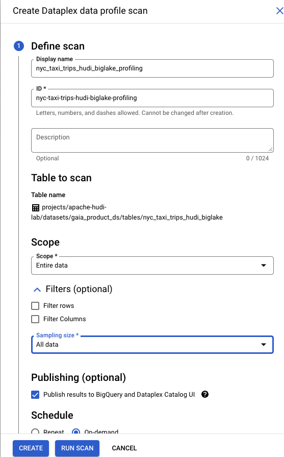
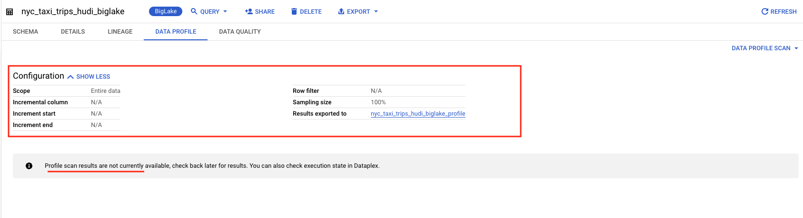
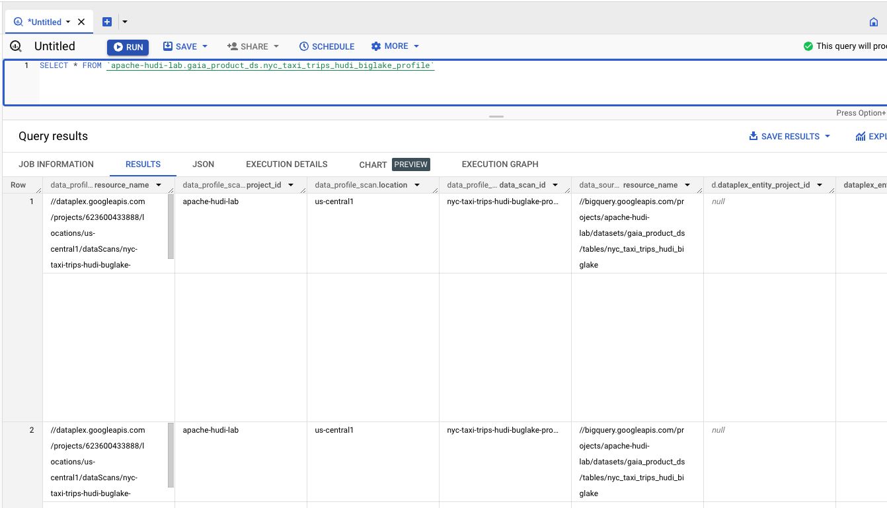

# Module 6: Auto Data Quality on Hudi snapshot BigLake tables, powered by Dataplex

This module covers Data Profiling and Auto Data Quality in Dataplex on BigLake tables - which in our case happens to be based on Hudi snapshots. 

## Lab Unit 1: Data Profiling

Dataplex offers a data profiling feature and this lab showcases the same.

### Terminology Levelset
Data profiling is the analytical process of capturing useful statistics of data. The results can provide actionable insights into data quality, trends and risks, for proactive remediation to eliminate any adverse impact.

There are several types of profiling. Dataplex does column-level profiling. 

### Value of Data Profiling
Among other benefits, the results of profiling can ALSO be leveraged by Dataplex for rule recommendations for Auto Data Quality - the main feature that is showcased in this lab module.

### 1.1. Create a Data Profile Scan on the Hudi snapshot BigLake table

Navigate to BigQuery and follw the screenshots below to create a Data Profiing Scan and run it, and persist results to BigQuery.

   
  

   
  

   
  

   
  

   
  

   
  

   
  

 

### 1.2. Refresh the page to view the results

Run the Data Profile Scan, as shown below. It takes about 10 minutes to complete.

   
  

### 1.3. Review the results persisted to BigQuery

   
  

   
  

 

## Lab Unit 2: Auto Data Quality

### 2.1. Navigate to Auto Data Quality in Dataplex UI

   
  

### 2.2. Create a Data Quality Scan

Follow the steps below, where we will use Dataplex recommendations for Data Quality rules based off of the profile scan we ran and create Data Quality scan.

   
  

   
  

   
  

   
  

   
  

   
  

   
  

   
  

   
  

   
  

   
  

   
  

### 2.3. Execute the Data Quality Scan

Follow the steps below, where we will execute the Data Quality scan we created.

   
  

   
  

   
  

### 2.4. Review the Data Quality Results in the Dataplex Auto Data Quality UI

   
  

   
  

### 2.5. Persisting the results to a BigQuery dataset

This feature is on the roadmap. Follow the author's [Dataplex Quickstart labs](https://github.com/GoogleCloudPlatform/dataplex-labs/tree/main/dataplex-quickstart-labs) for tutorials on the latest product updates.

  

This concludes thelab module. Please proceed to the next module.

 

