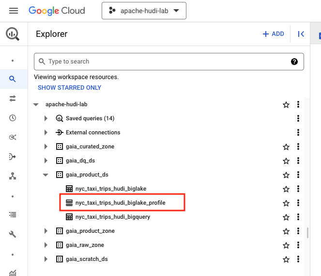
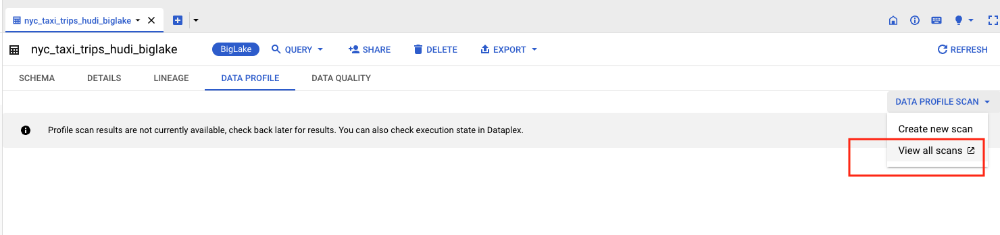
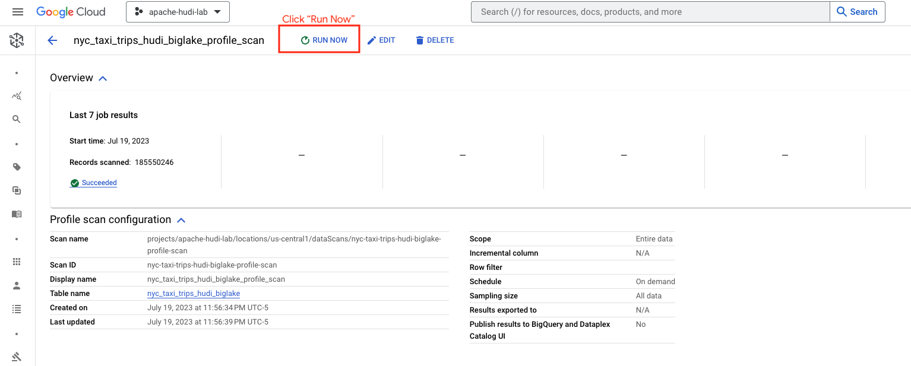
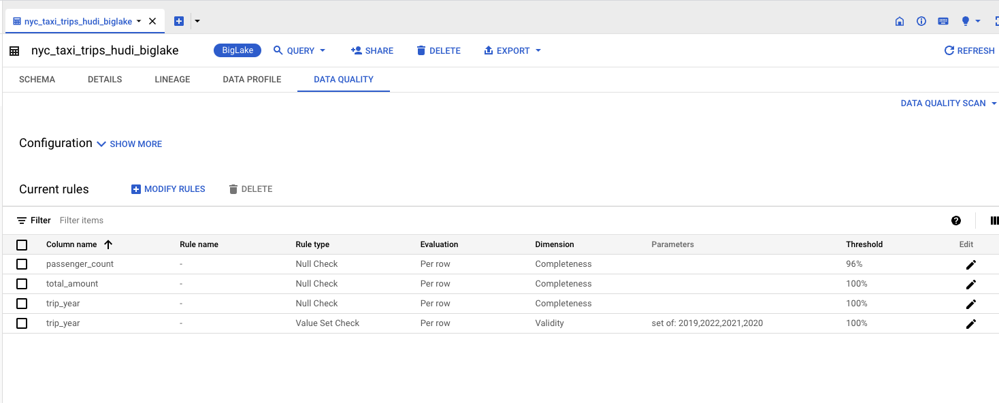

# Module 6: Auto Data Quality on Hudi snapshot BigLake tables, powered by Dataplex

This module covers Data Profiling and Auto Data Quality in Dataplex on BigLake tables - which in our case happens to be based on Hudi snapshots. 

## Lab Unit 1: Data Profiling

Dataplex offers a data profiling feature and this lab showcases the same.

### Terminology Levelset
Data profiling is the analytical process of capturing useful statistics of data. The results can provide actionable insights into data quality, trends and risks, for proactive remediation to eliminate any adverse impact.

There are several types of profiling. Dataplex does column-level profiling. 

### Value of Data Profiling
Among other benefits, the results of profiling can ALSO be leveraged by Dataplex for rule recommendations for Auto Data Quality - the main feature that is showcased in this lab module.

### 1.1. Create a Data Profile Scan on the Hudi snapshot BigLake table

Navigate to BigQuery and follw the screenshots below to create a Data Profiing Scan and run it, and persist results to BigQuery.

   
  

   
  

   
  

   
  

   
  

   
  

 

### 1.2. Refresh the page to view the results

Review the results presented in the GUI-

   
  

### 1.3. Review the results persisted to BigQuery

   
  

   
  

 

### 1.4. Run again & observe navigation into Dataplex GUI and how results are persisted across reruns

Run the scan again, notice how the navigation takes you into Dataplex Data Profiling UI. Follow the steps below. Study the results in BigQuery.

   
  

   
  

   
  

   
  

   
  

   
  

   
  

This concludes the unit on Data Profiling. Proceed to the unit on Data Quality.

 

## Lab Unit 2: Auto Data Quality

### 2.1. Navigate to the BigLake table in the BigQuery UI and cick on Data Quality

   
  

   
  

   
  

### 2.2. Start with defining a Data Quality Scan

Follow the steps below, and create Data Quality scan & execute it.

   
  

   
  

   
  

### 2.3. Define Data Quality rules

   
  

   
  

   
  

### 2.3. Execute the Data Quality Scan & wait for results

Follow the steps below, where we will execute the Data Quality scan we created.

   
  

   
  

### 2.4. Review the Data Quality Results in the Dataplex Auto Data Quality UI

   
  

   
  

### 2.5. How to view history

   
  

   
  

### 2.6. Review results in the BigQuery dataset

   
  

   
  

   
  

### 2.7. Run Auto Data Quality again and review the results in the GUI and in BigQuery

   
  

Note that each run has its own ID and you can see historically all the runs that were executed and review trends over time.
   
  

This concludes thelab module. Please proceed to the next module.

 

