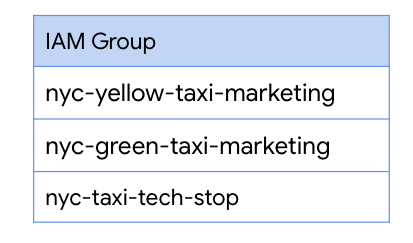
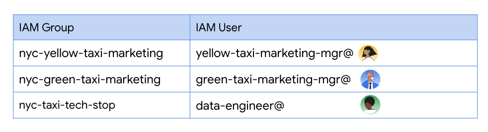
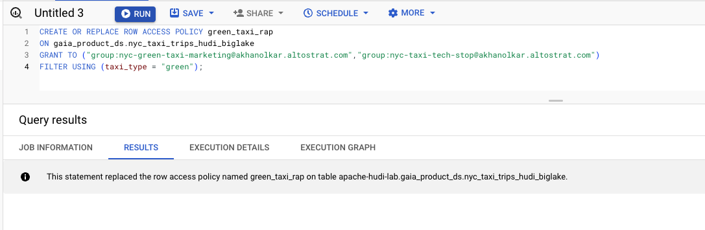
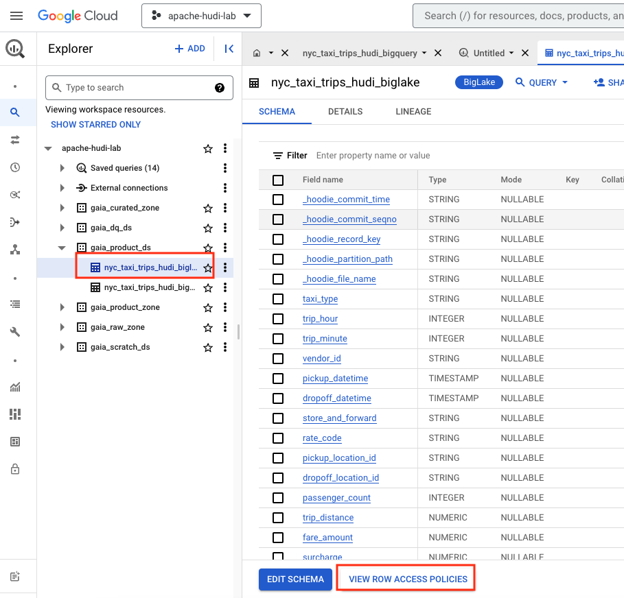
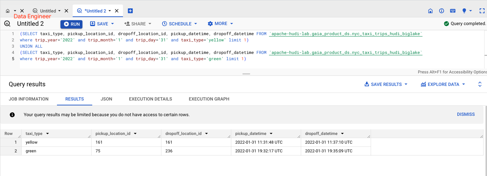

# Module 6a: Fine Grained Row Level Access Control powered by BigLake 

This module showcases Row Level Security made possible with BigLake on your Hudi snapshots sitting in Cloud Storage. In the next module, we will learn Column Level Security

<hr>

## 1. Foundational Security Setup for the lab module

We will create three IAM groups and three users belonging to them.
<br>

### 1.1. Create IAM groups

Create three IAM groups, similar to below from admin.google.com.

   
<br><br>

### 1.2. Create IAM users belonging to the three groups

Create three IAM users, and add them to the groups created above, as shown below.

   
<br><br>


### 1.3. Grant roles to the three users

Grant all the three users, the following roles:<br>
roles/viewer<br>
roles/storage.objectViewer<br>
roles/dataproc.editor<br>

E.g. Substitute the users below with yours and run in Cloud Shell:

```

PROJECT_ID=`gcloud config list --format "value(core.project)" 2>/dev/null`

YOUR_YELLOW_TAXI_USER_EQUIVALENT="PASTE_EMAIL_HERE"
YOUR_GREEN_TAXI_USER_EQUIVALENT="PASTE_EMAIL_HERE"
YOUR_DATA_ENGINEER_USER_EQUIVALENT="PASTE_EMAIL_HERE"

gcloud projects add-iam-policy-binding $PROJECT_ID --member user:$YOUR_YELLOW_TAXI_USER_EQUIVALENT --role=roles/viewer
gcloud projects add-iam-policy-binding $PROJECT_ID --member user:$YOUR_GREEN_TAXI_USER_EQUIVALENT --role=roles/viewer
gcloud projects add-iam-policy-binding $PROJECT_ID --member user:$YOUR_DATA_ENGINEER_USER_EQUIVALENT --role=roles/viewer

gcloud projects add-iam-policy-binding $PROJECT_ID --member user:$YOUR_YELLOW_TAXI_USER_EQUIVALENT roles/storage.objectViewer
gcloud projects add-iam-policy-binding $PROJECT_ID --member user:$YOUR_GREEN_TAXI_USER_EQUIVALENT roles/storage.objectViewer
gcloud projects add-iam-policy-binding $PROJECT_ID --member user:$YOUR_DATA_ENGINEER_USER_EQUIVALENT roles/storage.objectViewer

gcloud projects add-iam-policy-binding $PROJECT_ID --member user:$YOUR_YELLOW_TAXI_USER_EQUIVALENT --role=roles/dataproc.editor
gcloud projects add-iam-policy-binding $PROJECT_ID --member user:$YOUR_GREEN_TAXI_USER_EQUIVALENT --role=roles/dataproc.editor
gcloud projects add-iam-policy-binding $PROJECT_ID --member user:$YOUR_DATA_ENGINEER_USER_EQUIVALENT --role=roles/dataproc.editor
```

<br><br>

<hr>

## 2. Configuring Row Level Security (RLS) on BigLake tables


### 2.1. RLS security setup for the lab

We will create row level policies that allow yellow and green taxi marketing groups access to taxi trip data for the respective taxi type data (yellow taxi/green taxi). The tech stop team gets access to all taxi types.

   
<br><br>

To summarize:

   
<br><br>


<hr>

### 2.2. What's involved

   
<br><br>


<hr>

## 3. Lab

### 3.1. Create a RLS policy for Yellow Taxi data

In the sample below, the author is granting the groups, nyc-yellow-taxi-marketing@ and nyc-taxi-tech-stop@ access to yellow taxi data. <br>

Run the command below, after updating with your IAM groups, in the BigQuery UI-
```
CREATE OR REPLACE ROW ACCESS POLICY yellow_taxi_rap
ON gaia_product_ds.nyc_taxi_trips_hudi_biglake
GRANT TO ("group:YOUR_YELLOW_TAXI_IAM_GROUP", "group:YOUR_TECH_STOP_IAM_GROUP")
FILTER USING (taxi_type = "yellow");
```

Here is the author's command-
```
---THIS IS FYI only--------------------------------
CREATE OR REPLACE ROW ACCESS POLICY yellow_taxi_rap
ON gaia_product_ds.nyc_taxi_trips_hudi_biglake
GRANT TO ("group:nyc-yellow-taxi-marketing@akhanolkar.altostrat.com","group:nyc-taxi-tech-stop@akhanolkar.altostrat.com")
FILTER USING (taxi_type = "yellow");
```

   
<br><br>


<hr>


### 3.2. Create a RLS policy for Green Taxi data

In the sample below, the author is granting the groups, nyc-green-taxi-marketing@ and nyc-taxi-tech-stop@ access to green taxi data. <br>

Run the command below, after updating with your IAM groups, in the BigQuery UI-
```
CREATE OR REPLACE ROW ACCESS POLICY green_taxi_rap
ON gaia_product_ds.nyc_taxi_trips_hudi_biglake
GRANT TO ("group:YOUR_GREEN_TAXI_IAM_GROUP", "group:YOUR_TECH_STOP_IAM_GROUP")
FILTER USING (taxi_type = "green");
```

Here is the author's command-
```
---THIS IS FYI only--------------------------------
CREATE OR REPLACE ROW ACCESS POLICY green_taxi_rap
ON gaia_product_ds.nyc_taxi_trips_hudi_biglake
GRANT TO ("group:nyc-green-taxi-marketing@akhanolkar.altostrat.com","group:nyc-taxi-tech-stop@akhanolkar.altostrat.com")
FILTER USING (taxi_type = "green");
```
   
<br><br>


<hr>

### 3.3. View the RLS policies configured from the BigQuery UI

Navigate to the RLS policies as shown below-

   
<br><br>

   
<br><br>

   
<br><br>


<hr>

### 3.4. Managing RLS on BigLake tables

[Documentation](https://cloud.google.com/bigquery/docs/managing-row-level-security)

<br><br>

<hr>


## 4. Row Level Security on BigLake tables **in action** - with BQSQL from the BigQuery UI

We configured row level security as shown below. Lets see it in action. 

   
<br><br>

<br>

<hr>

### 4.1. Sign-in to the BigQuery UI as the **data engineer** & query the table from the BigQuery UI

Paste in the BigQuery UI:

```
(SELECT taxi_type, pickup_location_id, dropoff_location_id, pickup_datetime, dropoff_datetime FROM `apache-hudi-lab.gaia_product_ds.nyc_taxi_trips_hudi_biglake` 
where trip_year='2022' and trip_month='1' and trip_day='31' and taxi_type='yellow' limit 1)
UNION ALL
(SELECT taxi_type, pickup_location_id, dropoff_location_id, pickup_datetime, dropoff_datetime FROM `apache-hudi-lab.gaia_product_ds.nyc_taxi_trips_hudi_biglake`
where trip_year='2022' and trip_month='1' and trip_day='31' and taxi_type='green' limit 1)
```

You should see rows returned and no errors as we have excluded columns the data engineer is retricted from viewing.

   
<br><br>


<hr>

### 4.2. Sign-in to the BigQuery UI as the **yellow taxi marketing manager** & query the table from the BigQuery UI

Paste in the BigQuery UI:

```
(SELECT taxi_type, pickup_location_id, dropoff_location_id, pickup_datetime, dropoff_datetime FROM `apache-hudi-lab.gaia_product_ds.nyc_taxi_trips_hudi_biglake` 
where trip_year='2022' and trip_month='1' and trip_day='31' and taxi_type='yellow' limit 1)
UNION ALL
(SELECT taxi_type, pickup_location_id, dropoff_location_id, pickup_datetime, dropoff_datetime FROM `apache-hudi-lab.gaia_product_ds.nyc_taxi_trips_hudi_biglake`
where trip_year='2022' and trip_month='1' and trip_day='31' and taxi_type='green' limit 1)
```

You should see the warning --> "Your query results may be limited because you do not have access to certain rows" <-- and only rows granted access to are returned - in this case, yellow taxi trips ONLY.

   
<br><br>


<hr>

### 4.3. Sign-in to the BigQuery UI as the **green taxi marketing manager** & query the table from the BigQuery UI

Paste in the BigQuery UI:

```
(SELECT taxi_type, pickup_location_id, dropoff_location_id, pickup_datetime, dropoff_datetime FROM `apache-hudi-lab.gaia_product_ds.nyc_taxi_trips_hudi_biglake` 
where trip_year='2022' and trip_month='1' and trip_day='31' and taxi_type='yellow' limit 1)
UNION ALL
(SELECT taxi_type, pickup_location_id, dropoff_location_id, pickup_datetime, dropoff_datetime FROM `apache-hudi-lab.gaia_product_ds.nyc_taxi_trips_hudi_biglake`
where trip_year='2022' and trip_month='1' and trip_day='31' and taxi_type='green' limit 1)
```

You should see the warning --> "Your query results may be limited because you do not have access to certain rows" <-- and only rows granted access to are returned - in this case, green taxi trips ONLY.

   
<br><br>

<br>

<hr>

This concludes the module. Proceed to the next module to learn and try Column Level Security on BigLake tables built on top of Hudi snapshots.
