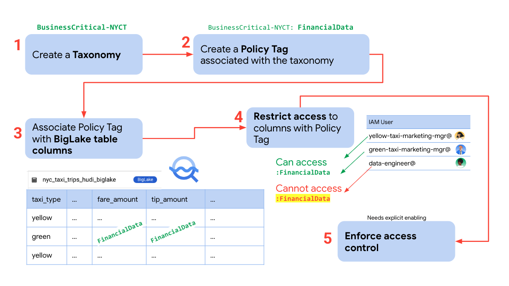
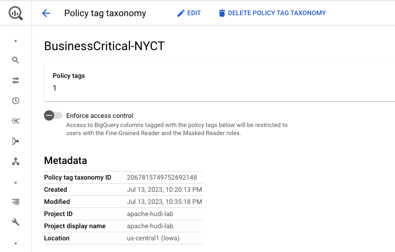
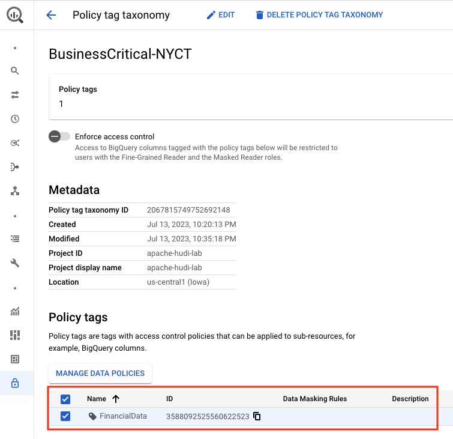
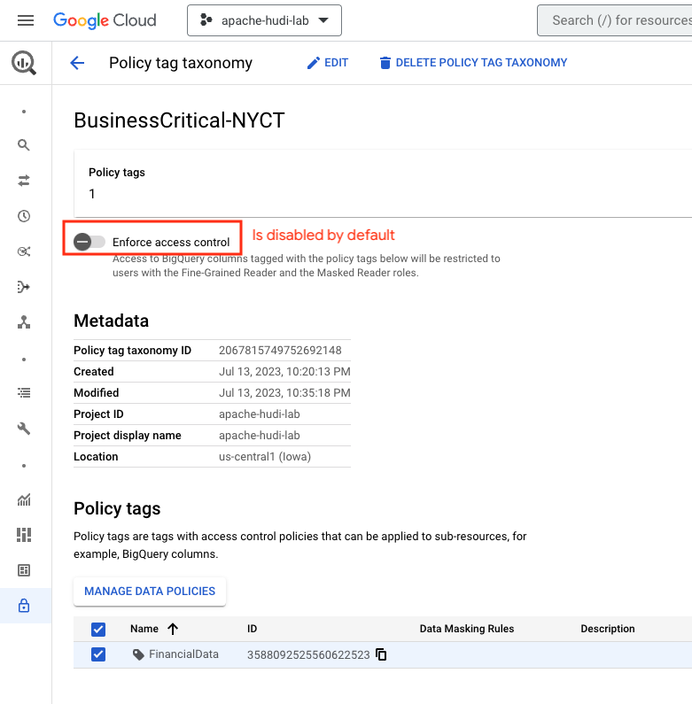
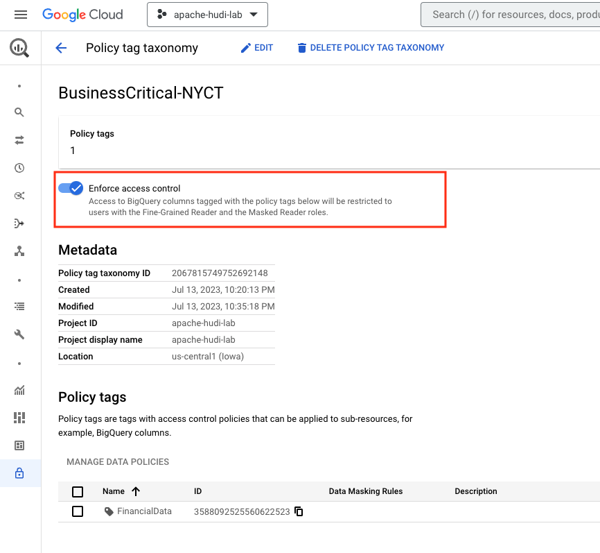
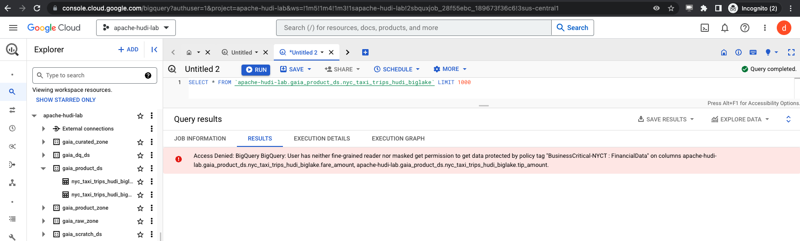
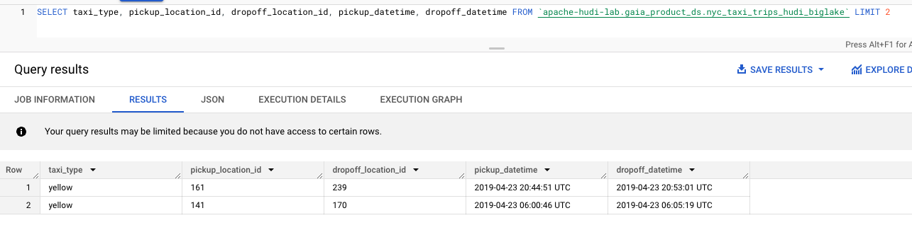

# Module 6b: Column Level Access Control powered by BigLake 

This module is a continuation of the prior module and showcases Column Level Security made possible with BigLake on your Hudi snapshots sitting in Cloud Storage. 

<hr>

## 1. Foundational Security Setup for the lab module

Covered in [Module 6a](Module-06a.md).
<hr>

## 2. Configuring Column Level Security (CLS) on BigLake tables

### 2.1. CLS security setup for the lab

   
<br><br>

<br><br>

<hr>

### 2.2. What's involved

   
<br><br>

<br><br>

<hr>

## 3. Lab

### 3.1. [Step 1] Create a taxonomy called "BusinessCritical-NYCT"

Run this in Cloud Shell-
```
PROJECT_ID=`gcloud config list --format "value(core.project)" 2>/dev/null`
PROJECT_NBR=`gcloud projects describe $PROJECT_ID | grep projectNumber | cut -d':' -f2 |  tr -d "'" | xargs`
LOCATION="us-central1"
TAXONOMY="BusinessCritical-NYCT"

rm -rf requestTaxonomyCreate.json
echo "{ \"displayName\": \"BusinessCritical-NYCT\" }" >>  requestTaxonomyCreate.json

curl -X POST -H "Authorization: Bearer $(gcloud auth print-access-token)" -H "x-goog-user-project: $PROJECT_ID" \
    -H "Content-Type: application/json; charset=utf-8" \
    -d @requestTaxonomyCreate.json \
    "https://datacatalog.googleapis.com/v1/projects/$PROJECT_ID/locations/$LOCATION/taxonomies"

```

Sample output of author-
```
INFORMATIONAL ONLY - DONT RUN THIS
{
  "name": "projects/apache-hudi-lab/locations/us-central1/taxonomies/2067815749752692148",
  "displayName": "BusinessCritical-NYCT",
  "taxonomyTimestamps": {
    "createTime": "2023-07-14T03:20:13.094Z",
    "updateTime": "2023-07-14T03:20:13.094Z"
  },
  "service": {}
}
```

Lets grab the Taxonomy ID for the next step:
```
TAXONOMY_ID=`gcloud data-catalog taxonomies list --location=$LOCATION | grep -A1 $TAXONOMY | grep taxonomies | cut -d'/' -f6`
```

   
<br><br>


   
<br><br>

<br><br>

<hr>

### 3.2. [Step 2] Create a policy tag called "FinancialData" under the taxonomy

Run this in Cloud Shell-
```

FINANCIAL_POLICY="FinancialData"

rm -rf requestPolicyTagCreate.json
echo "{ \"displayName\": \"$FINANCIAL_POLICY\" }" >>  requestPolicyTagCreate.json

curl -X POST -H "Authorization: Bearer $(gcloud auth print-access-token)" -H "x-goog-user-project: $PROJECT_ID" \
    -H "Content-Type: application/json; charset=utf-8" \
    -d @requestPolicyTagCreate.json \
    "https://datacatalog.googleapis.com/v1/projects/$PROJECT_ID/locations/$LOCATION/taxonomies/$TAXONOMY_ID/policyTags"

```

Sample output of author-
```
INFORMATIONAL ONLY - DONT RUN THIS
{
  "name": "projects/apache-hudi-lab/locations/us-central1/taxonomies/2067815749752692148/policyTags/3588092525560622523",
  "displayName": "FinancialData"
}
```

Lets grab the Policy Tag ID for the next step:
```
FINANCIAL_POLICY_TAG_ID=`gcloud data-catalog taxonomies policy-tags list --taxonomy=$TAXONOMY_ID --location=$LOCATION | grep policyTags | cut -d'/' -f8`
```

   
<br><br>

<br><br>

<hr>

### 3.3. [Step 3] Associate the policy with specific columns in the BigLake table

#### 3.3.1. Create a schema file locally with the policy tag assigned to fare_amount and tip_amount

In Cloud Shell, create a new file called nyc_taxi_trips_hudi_biglake_schema.json in your root directory and paste the below into it-
```
[
  {
    "mode": "NULLABLE",
    "name": "_hoodie_commit_time",
    "type": "STRING"
  },
  {
    "mode": "NULLABLE",
    "name": "_hoodie_commit_seqno",
    "type": "STRING"
  },
  {
    "mode": "NULLABLE",
    "name": "_hoodie_record_key",
    "type": "STRING"
  },
  {
    "mode": "NULLABLE",
    "name": "_hoodie_partition_path",
    "type": "STRING"
  },
  {
    "mode": "NULLABLE",
    "name": "_hoodie_file_name",
    "type": "STRING"
  },
  {
    "mode": "NULLABLE",
    "name": "taxi_type",
    "type": "STRING"
  },
  {
    "mode": "NULLABLE",
    "name": "trip_hour",
    "type": "INTEGER"
  },
  {
    "mode": "NULLABLE",
    "name": "trip_minute",
    "type": "INTEGER"
  },
  {
    "mode": "NULLABLE",
    "name": "vendor_id",
    "type": "STRING"
  },
  {
    "mode": "NULLABLE",
    "name": "pickup_datetime",
    "type": "TIMESTAMP"
  },
  {
    "mode": "NULLABLE",
    "name": "dropoff_datetime",
    "type": "TIMESTAMP"
  },
  {
    "mode": "NULLABLE",
    "name": "store_and_forward",
    "type": "STRING"
  },
  {
    "mode": "NULLABLE",
    "name": "rate_code",
    "type": "STRING"
  },
  {
    "mode": "NULLABLE",
    "name": "pickup_location_id",
    "type": "STRING"
  },
  {
    "mode": "NULLABLE",
    "name": "dropoff_location_id",
    "type": "STRING"
  },
  {
    "mode": "NULLABLE",
    "name": "passenger_count",
    "type": "INTEGER"
  },
  {
    "mode": "NULLABLE",
    "name": "trip_distance",
    "type": "NUMERIC"
  },
  {
    "mode": "NULLABLE",
    "name": "fare_amount",
    "type": "NUMERIC",
    "policyTags": {
      "names": ["projects/YOUR_PROJECT_ID/locations/YOUR_BQ_LOCATION/taxonomies/YOUR_TAXONOMY_ID/policyTags/YOUR_POLICY_TAG_ID"]
    }
  },
  {
    "mode": "NULLABLE",
    "name": "surcharge",
    "type": "NUMERIC"
  },
  {
    "mode": "NULLABLE",
    "name": "mta_tax",
    "type": "NUMERIC"
  },
  {
    "mode": "NULLABLE",
    "name": "tip_amount",
    "type": "NUMERIC",
    "policyTags": {
      "names": ["projects/YOUR_PROJECT_ID/locations/YOUR_BQ_LOCATION/taxonomies/YOUR_TAXONOMY_ID/policyTags/YOUR_POLICY_TAG_ID"]
    }
  },
  {
    "mode": "NULLABLE",
    "name": "tolls_amount",
    "type": "NUMERIC"
  },
  {
    "mode": "NULLABLE",
    "name": "improvement_surcharge",
    "type": "NUMERIC"
  },
  {
    "mode": "NULLABLE",
    "name": "total_amount",
    "type": "NUMERIC"
  },
  {
    "mode": "NULLABLE",
    "name": "payment_type_code",
    "type": "STRING"
  },
  {
    "mode": "NULLABLE",
    "name": "congestion_surcharge",
    "type": "NUMERIC"
  },
  {
    "mode": "NULLABLE",
    "name": "trip_type",
    "type": "STRING"
  },
  {
    "mode": "NULLABLE",
    "name": "ehail_fee",
    "type": "NUMERIC"
  },
  {
    "mode": "NULLABLE",
    "name": "partition_date",
    "type": "DATE"
  },
  {
    "mode": "NULLABLE",
    "name": "distance_between_service",
    "type": "NUMERIC"
  },
  {
    "mode": "NULLABLE",
    "name": "time_between_service",
    "type": "INTEGER"
  },
  {
    "mode": "NULLABLE",
    "name": "trip_year",
    "type": "STRING"
  },
  {
    "mode": "NULLABLE",
    "name": "trip_month",
    "type": "STRING"
  },
  {
    "mode": "NULLABLE",
    "name": "trip_day",
    "type": "STRING"
  }
]
```

<br><br>

#### 3.3.2. Update the schema file with your variables

Paste in Cloud Shell-
```
# Variables
PROJECT_ID=`gcloud config list --format "value(core.project)" 2>/dev/null`
PROJECT_NBR=`gcloud projects describe $PROJECT_ID | grep projectNumber | cut -d':' -f2 |  tr -d "'" | xargs`
LOCATION="us-central1"
TAXONOMY="BusinessCritical-NYCT"
FINANCIAL_POLICY="FinancialData"

# Capture IDs
TAXONOMY_ID=`gcloud data-catalog taxonomies list --location=$LOCATION | grep -A1 $TAXONOMY | grep taxonomies | cut -d'/' -f6`
FINANCIAL_POLICY_TAG_ID=`gcloud data-catalog taxonomies policy-tags list --taxonomy=$TAXONOMY_ID --location=$LOCATION | grep policyTags | cut -d'/' -f8`

echo "Taxonomy ID is $TAXONOMY_ID"
echo "Financial Policy Tag ID is $FINANCIAL_POLICY_TAG_ID"

# Substitute the variables in the schema file
sed -i s/YOUR_PROJECT_ID/$PROJECT_ID/g ~/nyc_taxi_trips_hudi_biglake_schema.json
sed -i s/YOUR_BQ_LOCATION/$LOCATION/g ~/nyc_taxi_trips_hudi_biglake_schema.json
sed -i s/YOUR_TAXONOMY_ID/$TAXONOMY_ID/g ~/nyc_taxi_trips_hudi_biglake_schema.json
sed -i s/YOUR_POLICY_TAG_ID/$FINANCIAL_POLICY_TAG_ID/g ~/nyc_taxi_trips_hudi_biglake_schema.json
```

Once you execute these commands, your schema file should have your values in them instead of the placeholders.


<br><br>


#### 3.3.3. Update the Biglake table schema with the file

Run the below in Cloud Shell-
```
bq update \
   $PROJECT_ID:gaia_product_ds.nyc_taxi_trips_hudi_biglake ~/nyc_taxi_trips_hudi_biglake_schema.json
```

<br><br>


#### 3.3.4. Validate the table update in the BigQuery UI


   
<br><br>

<br><br>

<hr>


### 3.4. [Step 4] Assign the policy to the taxi marketing managers to allow access to financials

Run this in Cloud Shell, after editing the command to reflect your user specific emails:
```
YELLOW_TAXI_USER_EMAIL="PASTE_EMAIL_HERE"
GREEN_TAXI_USER_EMAIL="PASTE_EMAIL_HERE"

curl -X POST -H "Authorization: Bearer $(gcloud auth print-access-token)" -H "x-goog-user-project: $PROJECT_ID" \
    -H "Content-Type: application/json; charset=utf-8" \
  https://datacatalog.googleapis.com/v1/projects/$PROJECT_ID/locations/$LOCATION/taxonomies/$TAXONOMY_ID/policyTags/${FINANCIAL_POLICY_TAG_ID}:setIamPolicy -d  "{\"policy\":{\"bindings\":[{\"role\":\"roles/datacatalog.categoryFineGrainedReader\",\"members\":[\"user:$YELLOW_TAXI_USER_EMAIL\",\"user:$GREEN_TAXI_USER_EMAIL\" ]}]}}"
```

Author's output:
```
INFORMATIONAL-
{
  "version": 1,
  "etag": "BwYAurecRgQ=",
  "bindings": [
    {
      "role": "roles/datacatalog.categoryFineGrainedReader",
      "members": [
        "user:green-taxi-marketing-mgr@akhanolkar.altostrat.com",
        "user:yellow-taxi-marketing-mgr@akhanolkar.altostrat.com"
      ]
    }
  ]
}
```

<br><br>

<hr>

### 3.5. [Step 5] Enforce the column level access control

Before we enforce, here is the taxonomy and policy tag we created-

   
<br><br>


Enforce by pasting in Cloud Shell-
```
PROJECT_ID=`gcloud config list --format "value(core.project)" 2>/dev/null`
PROJECT_NBR=`gcloud projects describe $PROJECT_ID | grep projectNumber | cut -d':' -f2 |  tr -d "'" | xargs`
LOCATION="us-central1"
FULLY_QUALIFIED_POLICY_TAG_ID="projects/$PROJECT_ID/locations/$LOCATION/taxonomies/$TAXONOMY_ID/policyTags/$FINANCIAL_POLICY_TAG_ID"

curl -X POST -H "Authorization: Bearer $(gcloud auth print-access-token)" -H "x-goog-user-project: $PROJECT_ID" \
    -H "Content-Type: application/json; charset=utf-8" \
    --data "{\"dataPolicyType\":\"COLUMN_LEVEL_SECURITY_POLICY\", \"dataPolicyId\": \"$FINANCIAL_POLICY_TAG_ID\", \"policyTag\": \"$FULLY_QUALIFIED_POLICY_TAG_ID\" }" \
    "https://bigquerydatapolicy.googleapis.com/v1/projects/$PROJECT_ID/locations/$LOCATION/dataPolicies"
```

Verify the same in the BigQuery UI-

   
<br><br>

   
<br><br>

   
<br><br>


<hr>


## 4. Column Level Security on BigLake tables **in action** with BQSQL from the BigQuery UI

To showcase column level security, we configured CLS as follows:

   
<br><br>

<hr>

### 4.1. Sign-in to the BigQuery UI as the **data engineer** & query the table from the BigQuery UI

Paste in the BigQuery UI:

```
SELECT * FROM `apache-hudi-lab.gaia_product_ds.nyc_taxi_trips_hudi_biglake` LIMIT 2
```

You should see the following error:

   
<br><br>

Paste in the BigQuery UI, columns other than fare_amount and tip_amount:

```
SELECT taxi_type, pickup_location_id, dropoff_location_id, pickup_datetime, dropoff_datetime FROM `apache-hudi-lab.gaia_product_ds.nyc_taxi_trips_hudi_biglake` LIMIT 2
```

OR

```
SELECT * EXCEPT (fare_amount, tip_amount) FROM `apache-hudi-lab.gaia_product_ds.nyc_taxi_trips_hudi_biglake` LIMIT 2
```

You should see results returned. Effectively ONLY the Data Engineer is restricted from accessing the columns fare_amount and tip_amount as configured.


   
<br><br>

<hr>

### 4.2. Repeat exercise as yellow taxi user
Paste in the BigQuery UI:

```
SELECT * FROM `apache-hudi-lab.gaia_product_ds.nyc_taxi_trips_hudi_biglake` where taxi_type='yellow' LIMIT 2
```

You should see the rows returned.
<br><br>

<hr>

### 4.3. Repeat exercise as green taxi user
Paste in the BigQuery UI:

```
SELECT * FROM `apache-hudi-lab.gaia_product_ds.nyc_taxi_trips_hudi_biglake` where taxi_type='green' LIMIT 2
```

You should see the rows returned.
<br><br>

<hr>

This concludes the module. Proceed to the [next module](Module-06c.md) to learn and try Column Level Masking on BigLake tables built on top of Hudi snapshots.

<hr>


