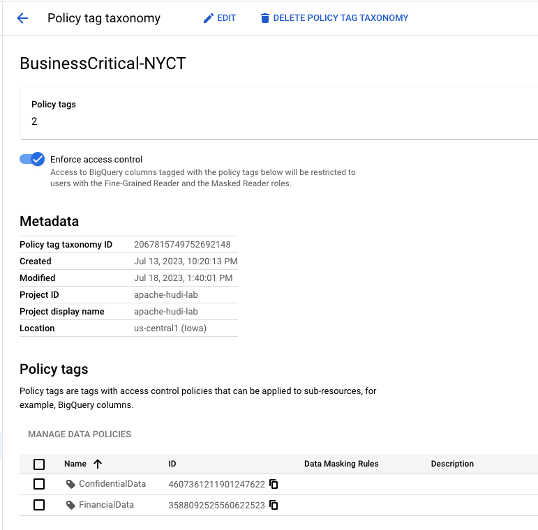
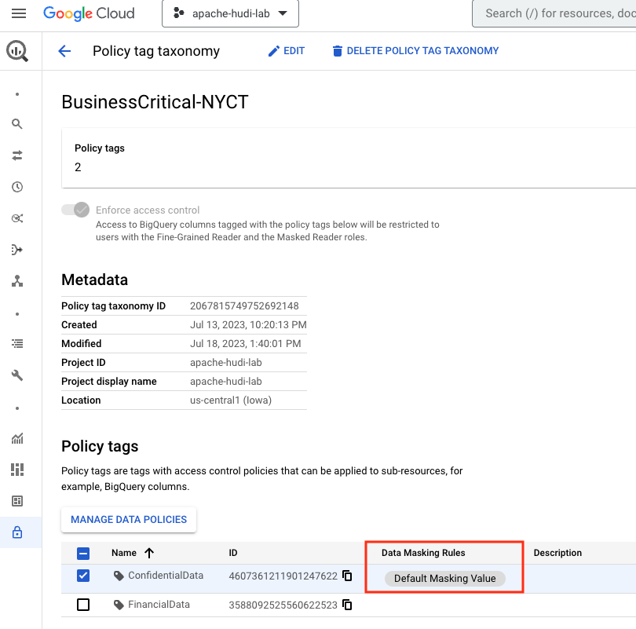
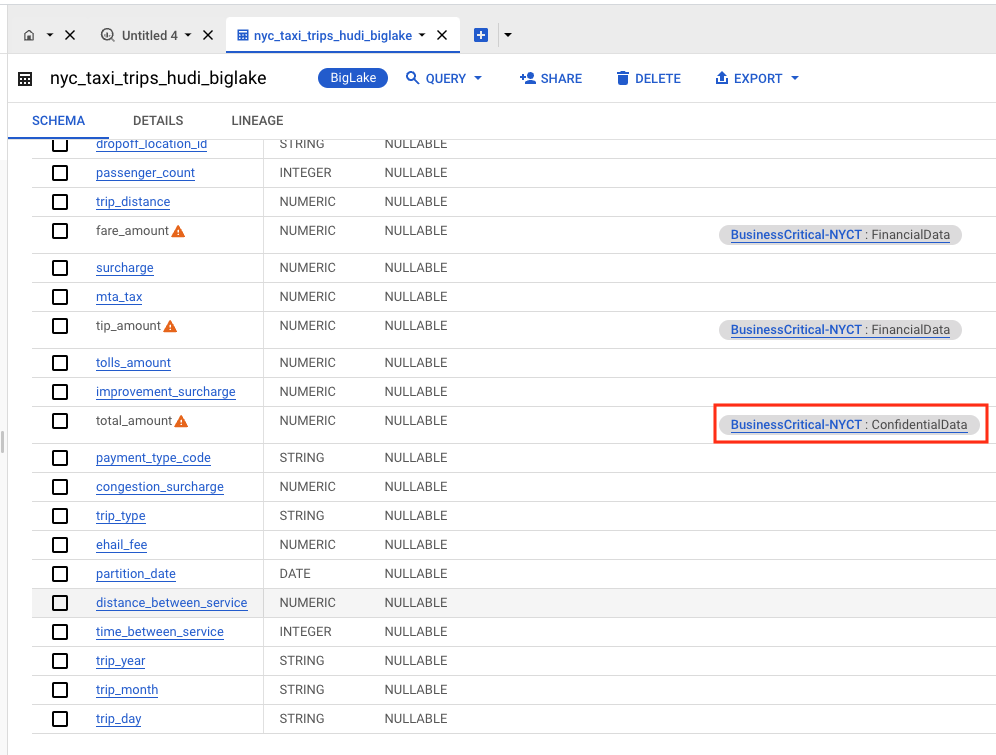
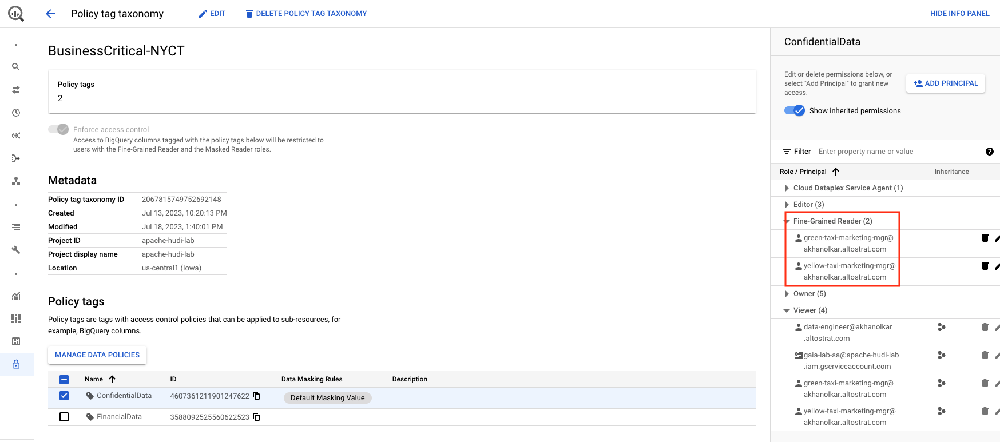

# Module 6c: Column Level Masking powered by BigLake 

This module is a continuation of the prior module and showcases Column Level Masking made possible with BigLake on your Hudi snapshots sitting in Cloud Storage. 

<hr>

## 1. Foundational Security Setup for the lab module

Covered in [Module 6a](Module-06a.md).
<hr>


## 2. Configuring Column Level Masking (CLM) - on BigLake tables 

### 2.1. CLM setup for the lab
Lets add masking to the setup we already did-

| User  |  Column Access | Access type | 
| :-- | :--- | :--- |
| yellow-taxi-marketing-mgr | All columns | Clear-text |
| green-taxi-marketing-mgr | All columns | Clear-text |
| data-engineer |  All columns except fare, tips & total amount | Masking of total_amount column |

<br><br>

### 2.2. What's involved

<br><br>

<hr>

## 3. Lab

### 3.1. [Step 1] Create a Taxonomy

We already created a taxonomy called "BusinessCritical-NYCT" in a [proir module](Module-06b.md), we will reuse the same.

<br>

<hr>

### 3.2. [Step 2] Create a policy tag called "ConfidentialData" under the taxonomy we already created earlier


Run this in Cloud Shell-
```
PROJECT_ID=`gcloud config list --format "value(core.project)" 2>/dev/null`
PROJECT_NBR=`gcloud projects describe $PROJECT_ID | grep projectNumber | cut -d':' -f2 |  tr -d "'" | xargs`
LOCATION="us-central1"

TAXONOMY="BusinessCritical-NYCT"
TAXONOMY_ID=`gcloud data-catalog taxonomies list --location=$LOCATION | grep -A1 $TAXONOMY | grep taxonomies | cut -d'/' -f6`
CONFIDENTIAL_POLICY_NM="ConfidentialData"

rm -rf ~/requestPolicyTagCreate.json
echo "{ \"displayName\": \"$CONFIDENTIAL_POLICY_NM\" }" >>  requestPolicyTagCreate.json

curl -X POST -H "Authorization: Bearer $(gcloud auth print-access-token)" -H "x-goog-user-project: $PROJECT_ID" \
    -H "Content-Type: application/json; charset=utf-8" \
    -d @requestPolicyTagCreate.json \
    "https://datacatalog.googleapis.com/v1/projects/$PROJECT_ID/locations/$LOCATION/taxonomies/$TAXONOMY_ID/policyTags"
```

Sample output of author-
```
INFORMATIONAL ONLY - DONT RUN THIS
{
  "name": "projects/apache-hudi-lab/locations/us-central1/taxonomies/2067815749752692148/policyTags/4607361211901247622",
  "displayName": "ConfidentialData"
}
```

Lets grab the Confidential Policy Tag ID for the next step:
```
CONFIDENTIAL_POLICY_TAG_ID=`gcloud data-catalog taxonomies policy-tags list --taxonomy=$TAXONOMY_ID --location=$LOCATION | grep -A1 ConfidentialData  | grep policyTags | cut -d'/' -f8`
```

Here is what the Taxonomy looks in the BigQuery UI-

   
<br><br>

<br>

<hr>

### 3.3. [Step 3] Create a (masking) data policy associated with the ConfidentialData policy tag created above

Paste the below in Cloud Shell-
```
PROJECT_ID=`gcloud config list --format "value(core.project)" 2>/dev/null`
PROJECT_NBR=`gcloud projects describe $PROJECT_ID | grep projectNumber | cut -d':' -f2 |  tr -d "'" | xargs`
LOCATION="us-central1"

TAXONOMY="BusinessCritical-NYCT"
TAXONOMY_ID=`gcloud data-catalog taxonomies list --location=$LOCATION | grep -A1 $TAXONOMY | grep taxonomies | cut -d'/' -f6`
CONFIDENTIAL_POLICY_NM="ConfidentialData"
CONFIDENTIAL_POLICY_TAG_ID=`gcloud data-catalog taxonomies policy-tags list --taxonomy=$TAXONOMY_ID --location=$LOCATION | grep -A1 ConfidentialData  | grep policyTags | cut -d'/' -f8`
DATA_POLICY_ID="NYCT_Fare_Masking"

curl -X POST -H "Authorization: Bearer $(gcloud auth print-access-token)" -H "x-goog-user-project: $PROJECT_ID" \
  -H "Content-Type: application/json; charset=utf-8" \
  --data "{\"dataPolicyType\":\"DATA_MASKING_POLICY\",\"dataMaskingPolicy\":{\"predefinedExpression\":\"DEFAULT_MASKING_VALUE\"},\"policyTag\":\"projects/$PROJECT_ID/locations/$LOCATION/taxonomies/$TAXONOMY_ID/policyTags/$CONFIDENTIAL_POLICY_TAG_ID\",\"dataPolicyId\":\"$DATA_POLICY_ID\"}" \
"https://bigquerydatapolicy.googleapis.com/v1/projects/$PROJECT_ID/locations/$LOCATION/dataPolicies"
```

Here is the author's output-
```
--THIS IS INFORMATIONAL ONLY--
{
  "name": "projects/apache-hudi-lab/locations/us-central1/dataPolicies/NYCT_Fare_Masking",
  "dataPolicyType": "DATA_MASKING_POLICY",
  "dataPolicyId": "NYCT_Fare_Masking",
  "policyTag": "projects/apache-hudi-lab/locations/us-central1/taxonomies/2067815749752692148/policyTags/4607361211901247622",
  "dataMaskingPolicy": {
    "predefinedExpression": "DEFAULT_MASKING_VALUE"
  }
}

```

Here is what the Taxonomy looks in the BigQuery UI after adding the masking data policy to the policy tag-

   
<br><br>

<br>

<hr>


### 3.4. [Step 4] Update the BigLake table schema file to associate the policy tag, "ConfidentialData" with the "total_amount" column in the BigLake table

We have a file locally already, that we created that has the schema of the BigLake table with the updates we made for the FinancialData policy tag. Lets add the ConfidentialData policy tag to the total_amount column. 

```
PROJECT_ID=`gcloud config list --format "value(core.project)" 2>/dev/null`
PROJECT_NBR=`gcloud projects describe $PROJECT_ID | grep projectNumber | cut -d':' -f2 |  tr -d "'" | xargs`
LOCATION="us-central1"

TAXONOMY="BusinessCritical-NYCT"
TAXONOMY_ID=`gcloud data-catalog taxonomies list --location=$LOCATION | grep -A1 $TAXONOMY | grep taxonomies | cut -d'/' -f6`
CONFIDENTIAL_POLICY_TAG_ID=`gcloud data-catalog taxonomies policy-tags list --taxonomy=$TAXONOMY_ID --location=$LOCATION | grep -A1 ConfidentialData  | grep policyTags | cut -d'/' -f8`

# Policy tag spec to insert into the schema file
POLICY_TAG_SPEC="    ,\"policyTags\": {\"names\": [\"projects/$PROJECT_ID/locations/$LOCATION/taxonomies/$TAXONOMY_ID/policyTags/$CONFIDENTIAL_POLICY_TAG_ID\"]}"

cd ~
# Copy the schema json
cp nyc_taxi_trips_hudi_biglake_schema.json dummy.json
# Insert policy tag into it
sed -i "126 a $POLICY_TAG_SPEC" dummy.json
# Format it
(rm -f nyc_taxi_trips_hudi_biglake_schema.json && cat dummy.json | jq . > nyc_taxi_trips_hudi_biglake_schema.json) < nyc_taxi_trips_hudi_biglake_schema.json
# Remove the dummy.json
rm dummy.json
```

<br><br>

<hr>

### 3.5. [Step 5] Update the BigLake table with the schema file 

Run the below in Cloud Shell-
```
bq update \
   $PROJECT_ID:gaia_product_ds.nyc_taxi_trips_hudi_biglake ~/nyc_taxi_trips_hudi_biglake_schema.json
```

<br>

   
<br><br>

<br>

<hr>

### 3.6. [Step 6] Grant the taxi marketing managers clear-text access to columns that are policy tagged as "ConfidentialData"

Run this in Cloud Shell, after editing the command to reflect your user specific emails:
```
YELLOW_TAXI_USER_EMAIL="yellow-taxi-marketing-mgr@akhanolkar.altostrat.com"
GREEN_TAXI_USER_EMAIL="green-taxi-marketing-mgr@akhanolkar.altostrat.com"

TAXONOMY="BusinessCritical-NYCT"
TAXONOMY_ID=`gcloud data-catalog taxonomies list --location=$LOCATION | grep -A1 $TAXONOMY | grep taxonomies | cut -d'/' -f6`
CONFIDENTIAL_POLICY_NM="ConfidentialData"
CONFIDENTIAL_POLICY_TAG_ID=`gcloud data-catalog taxonomies policy-tags list --taxonomy=$TAXONOMY_ID --location=$LOCATION | grep -A1 ConfidentialData  | grep policyTags | cut -d'/' -f8`

curl -X POST -H "Authorization: Bearer $(gcloud auth print-access-token)" -H "x-goog-user-project: $PROJECT_ID" \
    -H "Content-Type: application/json; charset=utf-8" \
  https://datacatalog.googleapis.com/v1/projects/$PROJECT_ID/locations/$LOCATION/taxonomies/$TAXONOMY_ID/policyTags/${CONFIDENTIAL_POLICY_TAG_ID}:setIamPolicy -d  "{\"policy\":{\"bindings\":[{\"role\":\"roles/datacatalog.categoryFineGrainedReader\",\"members\":[\"user:$YELLOW_TAXI_USER_EMAIL\",\"user:$GREEN_TAXI_USER_EMAIL\"]}]}}"

```


Author's output:
```
INFORMATIONAL-DO NOT RUN THIS-
{
  "version": 1,
  "etag": "BwYA2apTSco=",
  "bindings": [
    {
      "role": "roles/datacatalog.categoryFineGrainedReader",
      "members": [
        "user:green-taxi-marketing-mgr@akhanolkar.altostrat.com",
        "user:yellow-taxi-marketing-mgr@akhanolkar.altostrat.com"
      ]
    }
  ]
}
```

Here is what the ACLs look like in the UI-

   
<br><br>


<br>


<hr>


### 3.7. [Step 7] Grant the data engineer (data) masked access to the columns that are policy tagged as "ConfidentialData"

Paste the below in Cloud Shell-
```
PROJECT_ID=`gcloud config list --format "value(core.project)" 2>/dev/null`
PROJECT_NBR=`gcloud projects describe $PROJECT_ID | grep projectNumber | cut -d':' -f2 |  tr -d "'" | xargs`
LOCATION="us-central1"
DATA_POLICY_ID="NYCT_Fare_Masking"
DATA_ENGINEER_USER_EMAIL="REPLACE WITH YOUR DATA ENGINEER EMAIL"

curl -X POST -H "Authorization: Bearer $(gcloud auth print-access-token)" -H "x-goog-user-project: $PROJECT_ID" \
  -H "Content-Type: application/json; charset=utf-8" \
  --data "{\"policy\":{\"bindings\":[{\"members\":[\"user:$DATA_ENGINEER_USER_EMAIL\"],\"role\":\"roles/bigquerydatapolicy.maskedReader\"}]}}" \
 "https://bigquerydatapolicy.googleapis.com/v1/projects/$PROJECT_ID/locations/$LOCATION/dataPolicies/$DATA_POLICY_ID:setIamPolicy" 
```

Author's output:
```
INFORMATIONAL-DO NOT RUN THIS-
{
  "version": 1,
  "etag": "BwYA2aDzLak=",
  "bindings": [
    {
      "role": "roles/bigquerydatapolicy.maskedReader",
      "members": [
        "user:data-engineer@akhanolkar.altostrat.com"
      ]
    }
  ]
}
```

<br>

<hr>

## 4. Column Level Masking in action in BigLake table on Hudi snapshot


