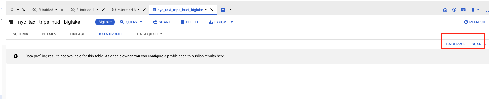
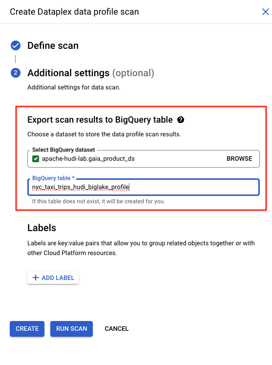

# Module 7: Auto Data Quality on Hudi snapshot BigLake tables, powered by Dataplex

This module covers Data Profiling and Auto Data Quality in Dataplex on BigLake tables - which in our case happens to be based on Hudi snapshots.<br>


## 1. Security setup

In order to run Data Profiling and Auto Data Quality, we have to grant ourselves the requisite roles to allow access to all columns; This means, we need column level access, same as the Yellow and Green Taxi users.

## 1.1. Querying the BigLake table from the BigQuery UI

Run the query below in the BigQuery UI; You should see the an error since you dont have the requisite row and column access-

```
SELECT * FROM `apache-hudi-lab.gaia_product_ds.nyc_taxi_trips_hudi_biglake` LIMIT 2
```

   
<br><br>


## 1.1. Grant yourself Column Level Access from Cloud Shell
Paste the below in Cloud Shell-
```
PROJECT_ID=`gcloud config list --format "value(core.project)" 2>/dev/null`
PROJECT_NBR=`gcloud projects describe $PROJECT_ID | grep projectNumber | cut -d':' -f2 |  tr -d "'" | xargs`
LOCATION="us-central1"
TAXONOMY="BusinessCritical-NYCT"
FINANCIAL_POLICY="FinancialData"
CONFIDENTIAL_POLICY="ConfidentialData"
YOUR_GCP_ACCOUNT_NAME=`gcloud auth list --filter=status:ACTIVE --format="value(account)"`
YOUR_GREEN_TAXI_USER_EMAIL="green-taxi-marketing-mgr@akhanolkar.altostrat.com"
YOUR_YELLOW_TAXI_USER_EMAIL="yellow-taxi-marketing-mgr@akhanolkar.altostrat.com"

# Capture IDs
TAXONOMY_ID=`gcloud data-catalog taxonomies list --location=$LOCATION | grep -A1 $TAXONOMY | grep taxonomies | cut -d'/' -f6`
FINANCIAL_POLICY_TAG_ID=`gcloud data-catalog taxonomies policy-tags list --taxonomy=$TAXONOMY_ID --location=$LOCATION | grep -A1 FinancialData | grep policyTags | cut -d'/' -f8`
CONFIDENTIAL_POLICY_TAG_ID=`gcloud data-catalog taxonomies policy-tags list --taxonomy=$TAXONOMY_ID --location=$LOCATION | grep -A1 $CONFIDENTIAL_POLICY  | grep policyTags | cut -d'/' -f8`

# Grant youself access to columns policy tagged as FinancialData
curl -X POST -H "Authorization: Bearer $(gcloud auth print-access-token)" -H "x-goog-user-project: $PROJECT_ID" \
    -H "Content-Type: application/json; charset=utf-8" \
  https://datacatalog.googleapis.com/v1/projects/$PROJECT_ID/locations/$LOCATION/taxonomies/$TAXONOMY_ID/policyTags/${FINANCIAL_POLICY_TAG_ID}:setIamPolicy -d  "{\"policy\":{\"bindings\":[{\"role\":\"roles/datacatalog.categoryFineGrainedReader\",\"members\":[\"user:$YOUR_GCP_ACCOUNT_NAME\", \"user:$YOUR_GREEN_TAXI_USER_EMAIL\",\"user:$YOUR_YELLOW_TAXI_USER_EMAIL\" ]}]}}"

# Grant youself access to columns policy tagged as ConfidentialData
curl -X POST -H "Authorization: Bearer $(gcloud auth print-access-token)" -H "x-goog-user-project: $PROJECT_ID" \
    -H "Content-Type: application/json; charset=utf-8" \
  https://datacatalog.googleapis.com/v1/projects/$PROJECT_ID/locations/$LOCATION/taxonomies/$TAXONOMY_ID/policyTags/${CONFIDENTIAL_POLICY_TAG_ID}:setIamPolicy -d  "{\"policy\":{\"bindings\":[{\"role\":\"roles/datacatalog.categoryFineGrainedReader\",\"members\":[\"user:$YOUR_GCP_ACCOUNT_NAME\", \"user:$YOUR_GREEN_TAXI_USER_EMAIL\",\"user:$YOUR_YELLOW_TAXI_USER_EMAIL\" ]}]}}"
```

### 1.2. Grant yourself Row Level Access from the BigQuery UI
Paste the below in your BigQuery UI after replacing the identities below:

```
CREATE OR REPLACE ROW ACCESS POLICY yellow_taxi_rap
ON gaia_product_ds.nyc_taxi_trips_hudi_biglake
GRANT TO ("group:YOUR_YELLOW_TAXI_IAM_GROUP", "group:YOUR_TECH_STOP_IAM_GROUP", "user:YOUR_EMAIL")
FILTER USING (taxi_type = "yellow");

CREATE OR REPLACE ROW ACCESS POLICY green_taxi_rap
ON gaia_product_ds.nyc_taxi_trips_hudi_biglake
GRANT TO ("group:YOUR_GREEN_TAXI_IAM_GROUP", "group:YOUR_TECH_STOP_IAM_GROUP", "user:YOUR_EMAIL")
FILTER USING (taxi_type = "green");
```

Here are the author's SQL - just for reference-
```
CREATE OR REPLACE ROW ACCESS POLICY yellow_taxi_rap
ON gaia_product_ds.nyc_taxi_trips_hudi_biglake
GRANT TO ("group:nyc-yellow-taxi-marketing@akhanolkar.altostrat.com","group:nyc-taxi-tech-stop@akhanolkar.altostrat.com", "user:admin@akhanolkar.altostrat.com")
FILTER USING (taxi_type = "yellow");

CREATE OR REPLACE ROW ACCESS POLICY green_taxi_rap
ON gaia_product_ds.nyc_taxi_trips_hudi_biglake
GRANT TO ("group:nyc-green-taxi-marketing@akhanolkar.altostrat.com","group:nyc-taxi-tech-stop@akhanolkar.altostrat.com", "user:admin@akhanolkar.altostrat.com")
FILTER USING (taxi_type = "green");

```

### 1.3. Validate access to the BigLake table from the BigQuery UI

Run the query below in the BigQuery UI; You should NOT see the any error, and see results returned as shown below-

```
SELECT * FROM `apache-hudi-lab.gaia_product_ds.nyc_taxi_trips_hudi_biglake` LIMIT 2
```

   
<br><br>

<hr>

<br>


## 1. Lab: Data Profiling

Dataplex offers a data profiling feature and this lab showcases the same.

### Terminology Levelset
Data profiling is the analytical process of capturing useful statistics of data. The results can provide actionable insights into data quality, trends and risks, for proactive remediation to eliminate any adverse impact.

There are several types of profiling. Dataplex does column-level profiling. 

### Value of Data Profiling
Among other benefits, the results of profiling can ALSO be leveraged by Dataplex for rule recommendations for Auto Data Quality - the main feature that is showcased in this lab module.

### 1.1. Create a Data Profile Scan on the Hudi snapshot BigLake table

Navigate to Dataplex and create a Data Profile scan as shown below, while logged in as yourself-

   
<br><br>

   
<br><br>

   
<br><br>

   
<br><br>

<hr>

<br>

### 1.2. Run the Data Profile Scan on the Hudi snapshot BigLake table

Run the Data Profile Scan, as shown below. It takes about 10 minutes to complete.

   
<br><br>

   
<br><br>

   
<br><br>

   
<br><br>

<hr>

<br>

### 1.3. Review the results


<hr>

<br>

