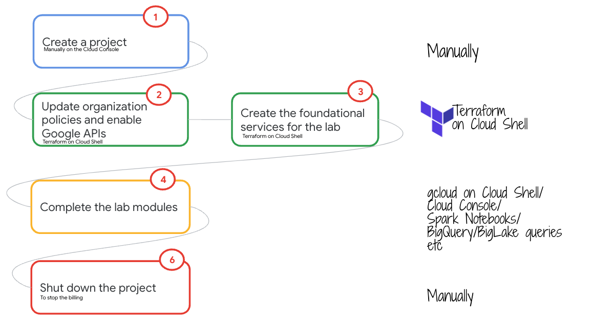

# Demystifying Apache Hudi support on Google Cloud Platform

## About the lab

Apache Hudi is a powerful table format with a number of capabilities that make it compelling to data engineers and it is making its way into enterprise architecture across the Google Cloud customer base. Due to its increasing popularity and customer demand, Cloud Dataproc, Google's Open Data Analytics managed platform, introduced Hudi libraries and configuration as part of its base image and the BigQuery product team improved the native BigQuery integration available in Apache Hudi.   

The lab is an effort to grow awareness about Apache Hudi on Google Cloud and is a community contribution. It is self paced, fully scripted, a module series that strives to demystify Apache Hudi integration in GCP services - specifically, Dataproc, Dataproc Metastore Service, BigQuery, BigLake, Dataplex and more, through simple hands on exercises. The labs starts with Hudi integration across products in scope, followed by Apache Hudi quickstart notebooks (work in progress) that gently introduce Apache Hudi itself if you are new to the table format.

The lab includes Terraform for provisioning automation. The lab guide is detailed with comprehensive instructions, screenshots, commands and such to provide a smooth learning experience. The lab guide can be read like a book if time constrained, for a visual overview of Hudi support on Google Cloud. 

## Lab goals

1. Provide comprehensive hands-on knowledge of Hudi support on Google Cloud, across Data Analytics services
2. Provide sample code/commands/such that can be repurposed for your Hudi workloads
4. Provide terraform for infrastructure provisioning, that can be repurposed for your Hudi workloads

## Lab Duration

~6 hours

## Lab Flow

   
  

## Lab Modules

| Module | Focus | 
| :-- | :--- |  
| [Module 01](03-lab-guide/Module-01.md) |  Infrastructure provisioning with Terraform | 
| [Module 02](03-lab-guide/Module-02.md) |  Generate Parquet data for the lab with Apache Spark on Cloud Dataproc-GCE |
| [Module 03](03-lab-guide/Module-03.md) |  Generate Hudi data for the lab with Apache Spark on Cloud Dataproc-GCE Register Hudi table definitions into Dataproc Metastore Explore Hudi tables from Jupyter notebooks on Dataproc with SparkSQL  | 
| [Module 04](03-lab-guide/Module-04.md) |  Integrate Hudi snapshot into BigQuery with the Apache Hudi BigQuerySyncTool |
| [Module 05](03-lab-guide/Module-05.md) |  Create BigLake external table on the Hudi snapshot |
| Module 06 |  Implement Fine Grained Access Control on Hudi Data Lakes, powered by BigLake |
| [Module 07](03-lab-guide/Module-07.md) |  Run Data Profiling and Data Quality on Hudi snapshot BigLake tables, powered by Dataplex |
| Module 08 |  Visualize Data Lineage with BigQuery/BigLake Hudi external tables, powered by Dataplex |
| Module 09 |  Execute quickstart Spark notebooks in Scala and Python to kick the tires with Apache Hudi |
| Module 10 |  Review automated technical metadata harevesting into Data Catalog and upload a Business Glossary for a Hudi snapshot table |

## Contributing
See the contributing instructions to get started contributing.

## License
All solutions within this repository are provided under the Apache 2.0 license. Please see the LICENSE file for more detailed terms and conditions.

## Disclaimer
This repository and its contents are not an official Google Product.

## Issues
Share you feedback, ideas, by logging issues.

## Release History

| # | Release Summary | Date | Contributor |
| :-- | :--- |  :--- |  :--- |  
| 1 |  Module 1-5 | 20230711 | Anagha Khanolkar, Google Cloud |

