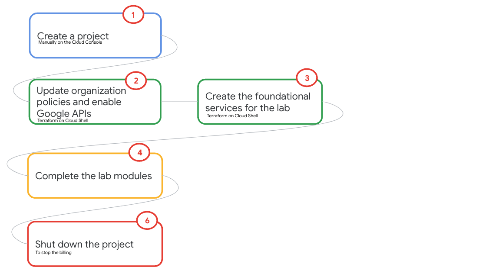

# Apache Hudi support on Google Cloud Platform

## About the lab

Apache Hudi is a powerful table format with a number of capabilities that make it compelling to data engineers and it is making its way into enterprise architecture across the Google Cloud customer base. Due to its increasing popularity and customer demand, Cloud Dataproc, Google's Open Data Analytics managed platform, offers Hudi libraries and configuration as part of its base image. The BigQuery product team has partnered with the Apache Hudi community, and improved the native BigQuery integration.   

The lab strives to demystify Apache Hudi integration in GCP services - specifically, Dataproc on GCE, Dataproc Metastore Service, BigQuery, BigLake, Dataplex and more, through simple hands on exercises. The labs starts with Hudi integration across products in scope, followed by Apache Hudi quickstart notebooks (work in progress) that gently introduce Apache Hudi itself if you are new to the table format.

The lab includes Terraform for provisioning automation. The lab guide is detailed with comprehensive instructions, screenshots, commands and such to allow for a smooth learning experience. The lab guide can be read like a book if time constrained, for a visual overview of Hudi support on Google Cloud. 

## Lab goals

1. Comprehensive knowledge of Hudi support on Google Cloud
2. Ability to demonstrate Hudi support on Google Cloud - across products
3. Sample code/commands and such that can be repurposed for your Hudi workloads
4. Terraform code that can be repurposed for your Hudi workloads

## Lab Duration

~4-5 hours

## Lab Flow

   
  

## Lab Solution Architecture

## Lab Modules

